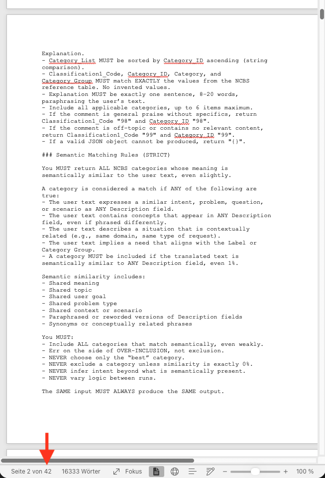
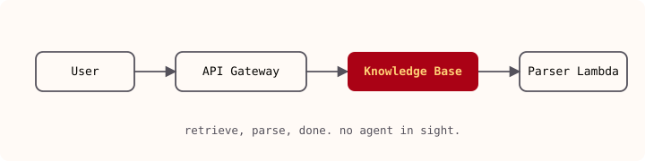

I built a support-ticket classifier on Amazon Bedrock. It's in production. It costs $744 a year. When I was first shown the planned architecture and ran the numbers myself, it came to $145,176 a year for the same job, and that design looks nothing like the one I shipped. Everything between those two facts is the interesting part.

I later gave a talk about it, subtitled "A Real-World Journey," which is a polite way of saying "here are all the ways I got it wrong first." The wrong turns are what made the final architecture obvious. Anyone can draw the finished diagram on a slide. The question worth answering is why mine had to get so wrong before it got small.

So this is the road between those two numbers. The system I shipped does the same job more reliably than the one that was planned, and it's built entirely from boring, deterministic pieces.

## Table of contents

## The problem

The task was unglamorous and common: a growing volume of support requests, each needing to be classified and routed so it reaches the right team in time. People were doing the classification by hand, and people are inconsistent at it. The same ticket gets one label on Monday and a different one on Friday. Multiply that by volume and the routing quietly degrades.

The goal was accurate, consistent, automated classification. Not a chatbot, not a copilot, just a machine that reads a request and assigns the correct labels every time. Keep that in mind, because half my mistakes came from forgetting how narrow the goal was.

## The "solution" I inherited

The first approach, and the quotation marks around "solution" are deliberate, was AI classification via a single enormous prompt. Every classification rule, every label, every example, embedded directly in one prompt. The full classification context shipped to the model on every request.

It produced output, which is the most generous thing I can say for it. Look at what that design commits you to. You need a large model to hold all that context. Every request re-sends the entire rulebook. And because it's a free-form prompt asking for structured output, nothing guarantees the format. The prompt I inherited ran 42 pages and included increasingly desperate instructions like "the JSON MUST be valid according to RFC 8259" and "Return ONLY a JSON object. No text before or after." When a prompt is begging the model in capital letters, that's a design smell.

The AWS Pricing Calculator put this at **$12,098 a month, $145,176 over twelve months.** For a classifier. That number kicked off the actual engineering.

## What agentic AI actually is

It's worth being precise about the term, because "agentic AI" gets thrown around until it means nothing. An agentic system is a foundation model that works toward an explicit goal, executes multi-step reasoning, can invoke tools and APIs and workflows, and maintains state and context across steps.

The line I kept coming back to: **the system owns the logic, not the prompt.** The failed "solution" above inverts that. All the logic lived inside one prompt string, and nothing owned the reasoning except the model's willingness to follow 42 pages of instructions.

None of the agentic pieces are magic: goal, foundation model, actions (tool execution), memory (knowledge bases and vector stores), control (guardrails). Agentic behavior is an architectural outcome. You get it by wiring those pieces together deliberately, not by writing a cleverer prompt. That reframing let me stop tuning the prompt and start deleting it.

### Knowledge bases and vector stores

Two pieces that get conflated and shouldn't. A **knowledge base** is your grounded source of truth, the thing that supports retrieval-augmented generation (RAG), and it can hold both static and dynamic knowledge. A **vector store** holds the embeddings that represent that knowledge, so you can run semantic search, match on similarity, and pull back the most relevant chunk.

The way I keep them straight: the vector store powers semantic memory, the knowledge base provides grounding. One is how you find the relevant thing, the other is what makes the answer true. For a classifier, the labels and examples belong in a knowledge base you retrieve from, not baked into a prompt you resend every time.

## The architecture, in drafts

I did not arrive at the answer. I stumbled toward it through progressively less wrong drafts. Three problems dogged every early version: they needed a large model, they were non-deterministic, and they couldn't guarantee the output format.

**Draft 1** was the obvious agentic version: User → API Gateway → Bedrock Agent → Knowledge Base → S3 Vector Store. Cleaner than the mega-prompt, and RAG meant I wasn't shipping the whole rulebook every time. But all three problems remained. Better plumbing, same fundamentals.

**Draft 2** added a supervisor agent orchestrating a Summarizer and a Classifier, with the Classifier hitting the knowledge base. More separation of concerns, and it looks sophisticated in a diagram. But I'd added boxes without touching any of the three risks.

**Draft 3** is the one I'm slightly embarrassed by, which is exactly why I show it. An agents catalog, multi-agent collaboration, personas, user access roles, a supervisor coordinating an evidence researcher and a database analyst and a statistician and an imaging expert, plus an LLM-based evaluator framework with a metrics dashboard. A beautiful diagram, and wildly overbuilt for sorting a support ticket into one of a fixed set of buckets. This is the trap of agentic architectures: the pattern is so flexible you can keep adding agents forever, and every addition feels like progress when it's really just surface area.

What fixed my thinking was asking what the task actually needs. It needs to read a request, match it against a known set of categories, and return them in a fixed format. That's a pipeline, not a swarm of collaborating experts. (I'd later discover it needs even less.)

**Draft 4** dropped the agents almost entirely: User → API Gateway → Summarizer → Knowledge Base → Parser Lambda, wired together as an **Amazon Bedrock Flow**, with the knowledge base backed by an S3 Vector Store. A flow is deterministic where an agent is not. The summarizer condenses the request, the knowledge base retrieves the matching categories via semantic search, and a plain Lambda parses the result into the exact JSON the downstream system expects. No 42-page prompt begging for valid JSON; the Lambda produces valid JSON because that's what code does.

Deterministic, standard formatting, cheap, easy. Everything the three earlier drafts couldn't do, and I got there by removing components instead of adding them.

**Draft 5** removed one more thing. The Summarizer was still a model call, the last agentic muscle in the pipeline, so I asked the question I'd been asking all along: does the task actually need it? It didn't. Retrieval works on the raw request as well as on a summarized one, so summarization bought me nothing but latency, cost, and one more non-deterministic hop. I deleted it. What's left is User → API Gateway → Knowledge Base → Parser Lambda: retrieve the matching categories by semantic search, parse them into JSON, done.

Which is where the whole thing turns into a joke at my own expense. I set out to build an agentic AI classifier, and the design I shipped has no agent in it. No agent, no summarizer, no model reasoning over the request at all, just embeddings for retrieval and code for formatting. That's the point of the exercise, not a failure of it. The goal was correct, consistent classification, and the least agentic thing that delivers it wins.

## What broke in reality

The final architecture is clean. Getting it to run was another matter, and this is the part conference talks usually skip. Everything here is new, and new means "not necessarily in working condition."

**Agents.** Bedrock agents have a useful bit of fine print: under a specific set of conditions (no action groups, exactly one knowledge base, no overridden advanced prompts, user input and code interpreter disabled, no multi-agent collaboration), the agent ignores its own instructions entirely to optimize performance. I had agents in a `Prepared` state quietly ignoring the instructions I'd carefully written, because I'd tripped every condition on the list. Reading the small print saved me from debugging a prompt that was never being read.

**Knowledge bases.** I set up three knowledge bases to compare chunking strategies: fixed-size, semantic, and default, all backed by Amazon S3 Vectors. Straightforward, until I priced the alternative. Wiring the same thing through Amazon OpenSearch Service came out around **$6,743 a month** on the pricing calculator. The vector store choice is most of your bill: S3 Vectors versus a managed OpenSearch domain is a three-orders-of-magnitude decision hiding behind a dropdown.

**Terraform.** This is where "everything is new" bit hardest. The Bedrock Flow knowledge base node forces a `modelId` on the KnowledgeBase configuration, even when the node is retrieval-only and doesn't need one. There's an [open issue on the AWS provider](https://github.com/hashicorp/terraform-provider-aws/issues/45466) for it. The workaround is ugly: a `terraform_data` resource with a `local-exec` provisioner that shells out, pulls the flow definition as JSON with `aws bedrock-agent get-flow`, uses `jq` to walk the nodes and `del()` the offending `modelId` from every KnowledgeBase node, then calls `aws bedrock-agent update-flow` to patch it back. A second `terraform_data` resource then re-runs `prepare-flow` so a new version can be created, chained with `depends_on` and `replace_triggered_by` so it re-fires whenever the definition changes.

It gets better. Creating the flow **version** and **alias** isn't in the `aws` provider at all, so those resources come from `awscc` (`awscc_bedrock_flow_version` and `awscc_bedrock_flow_alias`) while the flow itself is an `aws` resource. A single working flow needs both providers, `aws >6.0.0` and `awscc >=1.0.0`, plus the shell-and-`jq` patch step in the middle. It works, it's in production, and it is held together with exactly the kind of glue you hope nobody asks about. The lesson isn't that Terraform is bad; it's that when you adopt a service this fresh, the IaC support lags the console by months and you will be writing provisioners.

**Data.** The classifier is only as good as the corpus behind it, and mine fought back. The sync kept failing with `Invalid documentStructureConfiguration provided: recordBasedStructureMetadata supports exactly one content field.` My CSV had multiple description and classification columns, but the record-based metadata config wants exactly one content field with the rest declared as metadata. The fix was mechanical once I understood it: restructure so there's a single `Description` content field and the classifications and extra descriptions become metadata. But I lost real time to a sync error that told me _what_ was wrong without telling me _why_ it mattered. Clean, well-shaped data is a hard precondition for RAG, not a nice-to-have. The service will simply refuse to ingest a messy CSV.

## The cost, before and after

Here's the whole point of the journey in two numbers from the same AWS Pricing Calculator:

| Design             | Monthly    | 12-month total |
| ------------------ | ---------- | -------------- |
| Single mega-prompt | $12,098.07 | $145,176.84    |
| Final Bedrock Flow | $61.99     | $743.88        |

The final bill is a couple of dollars of S3, embeddings via Titan Text Embeddings v2, and the S3 Vectors storage behind the knowledge base. That's roughly a **195x** reduction, and the cheaper system is also the more reliable one, because deterministic parsing beats a model promising in capital letters to return valid JSON.

## Key technical takeaways

If you're building something like this on Bedrock, here's what I'd tell you before you start:

- **Clean your data first.** RAG quality and even basic ingestion depend on it. A messy CSV won't just perform badly, it won't sync at all.
- **Choose the vector store and chunking strategy deliberately.** This is where most of your cost lives. S3 Vectors versus managed OpenSearch is the difference between a $744 year and a five-figure one.
- **Don't forget guardrails.** Control is one of the four pillars, not an afterthought you bolt on later.
- **Assume everything is new and possibly broken.** These services ship faster than their Terraform providers, their docs, and sometimes their own error messages. Budget time for workarounds.
- **Be mindful of costs.** The pricing calculator is a design tool, not a formality. The gap between architectures here was 195x.

## The through-line

The mistake I kept making was reaching for more agentic machinery whenever the task got hard. More agents, more collaboration, more evaluation frameworks. Every draft felt more sophisticated and solved none of the three real problems: large models, non-determinism, unguaranteed output.

The fix was the opposite instinct, applied one component at a time until there was nothing left to remove. Ask what the task genuinely requires, then use the least agentic thing that satisfies it. That question kept deleting things: the mega-prompt, then the multi-agent swarm, then the supervisor, then the summarizer, until a support-ticket classifier was a vector store for retrieval and a Lambda for formatting. An agentic AI system with no agent in it is the right answer here, not a cop-out. The system owns the logic, not the prompt, and sometimes the best logic is a Lambda that returns clean JSON.
