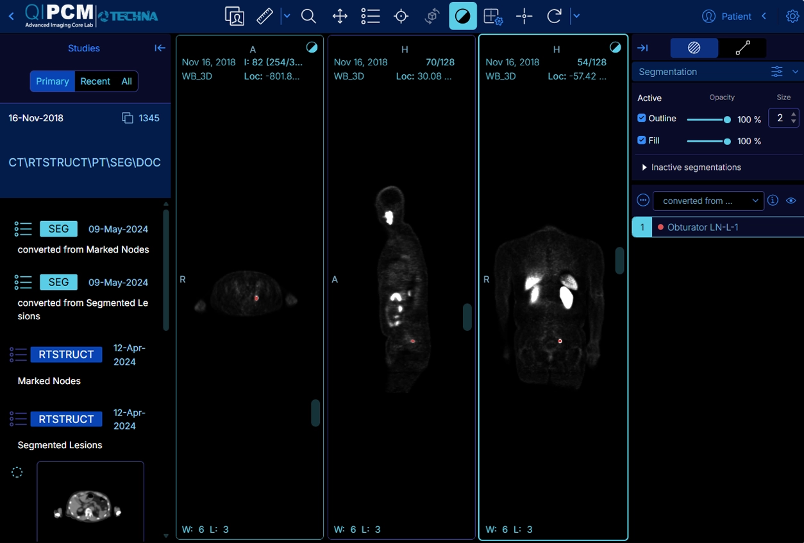
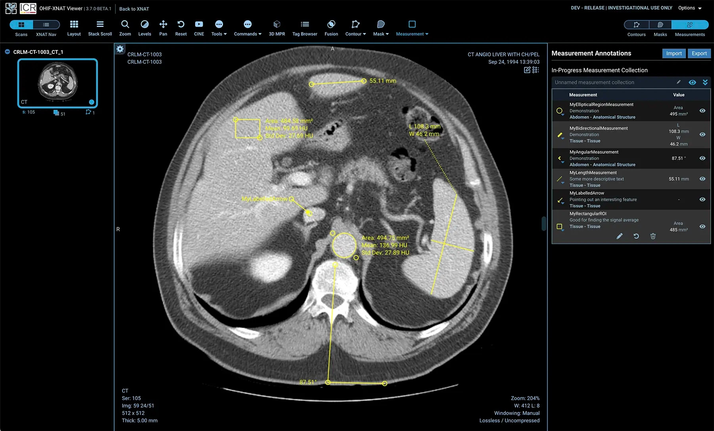

I've accumulated a small collection of medical imaging over the years. An X-ray here, a CT there, eventually an MRI. The workflow is always the same: go to the radiologist, lie still for a while, and walk out with two items. A printed sheet with a few selected images on it, and a disc. You bring both to your doctor, they read the radiologist's report, maybe glance at the prints, and tell you whether things look fine or not.

Done. Nobody looks at the disc again.

## Table of contents

## What's actually on the disc

I looked. Out of curiosity more than anything. I expected to find the same images that were on the printed sheet, maybe as JPEGs or PDFs.

What I found was something completely different. The disc doesn't contain pictures. It contains DICOM files. DICOM (Digital Imaging and Communications in Medicine) is the standard format that medical imaging equipment uses internally. It's what the scanners produce, what radiologists view in their professional workstations, and what hospitals store in their archives.

A single CT scan isn't one image. It's hundreds of slices, each a cross-section of your body at a slightly different depth. The printed sheet your doctor gets? That's maybe 6-8 of those slices, chosen by the radiologist as the most relevant ones. The disc has all of them. Every angle, every slice, every sequence. For an MRI, you might have multiple sequences (T1, T2, FLAIR, contrast-enhanced), each with dozens to hundreds of images.

You can view all of this yourself. The tools that doctors use to examine these scans are open source.

## The tools already exist

Two projects do the heavy lifting:

**[Orthanc](https://www.orthanc-server.com/)** is an open-source DICOM server. It stores and serves medical images using the same protocols that hospital systems use. You upload your DICOM files to it, and it organizes them by patient, study, and series. It's lightweight, runs in Docker, and uses PostgreSQL for its index.

**[OHIF Viewer](https://ohif.org/)** is an open-source medical image viewer. It connects to Orthanc (or any DICOM-compliant server) and gives you a proper radiology workstation in your browser. You can scroll through slices, adjust window/level (brightness and contrast for different tissue types), measure distances and angles, compare sequences side by side, and view different anatomical planes.



<center><em>Sample data from the <a href="https://ohif.org/showcase">OHIF showcase</a>.</em></center>

You can even build 3D reconstructions from your CT data. The same cross-sectional slices that were printed flat on a sheet can be stacked and rendered as a volume, letting you rotate and inspect the anatomy from any angle.

Both are open source, both run in Docker, and the setup is straightforward.

## Self-hosting it on a NAS

I run the whole stack on my TrueNAS instance at home. The setup is four containers behind an Nginx reverse proxy:

1. **Nginx** (orthancteam/orthanc-nginx) serving as the entry point and reverse proxy
2. **OHIF** (orthancteam/ohif-v3) for the browser-based viewer
3. **Orthanc** (orthancteam/orthanc) as the DICOM server with DICOMweb enabled
4. **PostgreSQL** for the Orthanc index

The Orthanc team publishes Docker images that are designed to work together. Here's a cleaned-up `docker-compose.yml`:

```yaml
services:
  nginx:
    image: orthancteam/orthanc-nginx:26.4.0
    restart: unless-stopped
    ports:
      - "8080:80"
    depends_on:
      - orthanc
      - ohif
    environment:
      ENABLE_ORTHANC: "true"
      ENABLE_KEYCLOAK: "false"
      ENABLE_ORTHANC_TOKEN_SERVICE: "false"
      ENABLE_HTTPS: "false"
      ENABLE_OHIF: "true"

  ohif:
    image: orthancteam/ohif-v3:26.4.1
    restart: unless-stopped

  orthanc:
    image: orthancteam/orthanc:26.4.2
    restart: unless-stopped
    volumes:
      - orthanc-data:/var/lib/orthanc/db/
    environment:
      ORTHANC__NAME: "Home DICOM Server"
      DICOM_WEB_PLUGIN_ENABLED: "true"
      ORTHANC__AUTHENTICATION_ENABLED: "false"
      ORTHANC__POSTGRESQL: |
        {
          "Host": "orthanc-index"
        }

  orthanc-index:
    image: postgres:15
    restart: unless-stopped
    volumes:
      - postgres-data:/var/lib/postgresql/data
    environment:
      POSTGRES_HOST_AUTH_METHOD: "trust"

volumes:
  orthanc-data:
  postgres-data:
```

Point your browser at the Nginx port, and you get both the Orthanc explorer (for managing and uploading studies) and the OHIF viewer (for actually viewing them).

When I get a new disc from a radiologist, I pop it into my laptop, upload the DICOM files to Orthanc through its web interface, and from then on those scans are permanently stored on my NAS, viewable from any device on my network.

## What you actually see vs. what your doctor gets

The difference is substantial. The printed sheet is a lossy snapshot: a handful of pre-selected slices, fixed contrast, no interactivity. The DICOM data is the full acquisition. You can:

- Scroll through every slice of a CT or MRI, not just the ones someone picked for the printout
- Adjust windowing to see soft tissue, bone, or lung detail from the same scan
- Compare current scans with older ones side by side
- View sagittal, coronal, and axial planes from a single acquisition
- Measure structures yourself (with the caveat that you're not trained to interpret what you're measuring)
- Build 3D volume renderings from CT data



<center><em>Sample data from the <a href="https://ohif.org/showcase">OHIF showcase</a>.</em></center>

I'm not a radiologist. But being able to look at my own scans in full, on my own time, and bring specific questions to my next appointment rather than just nodding at a printed sheet, is worth the afternoon it took to set up.

## Tying it together

This is the third post in a series about data that's mine, stored in formats I didn't know about, viewable with tools that already exist but that nobody mentioned. DNA, sleep data, and now medical imaging. All of it runs on my home server.

The disc is yours. The tools to read it are free.
