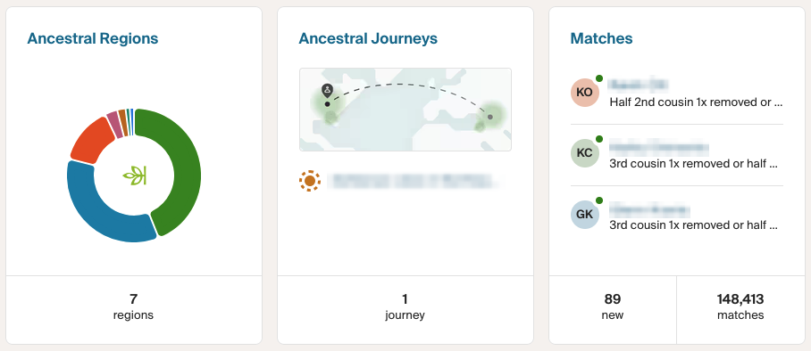
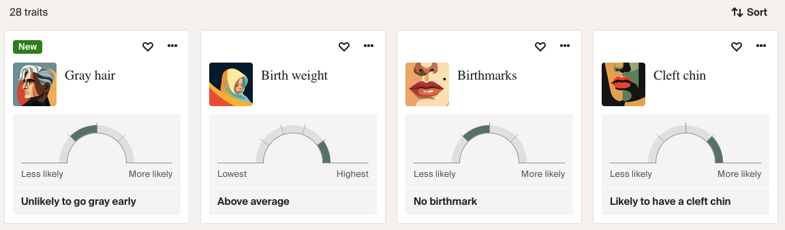

Have you ever felt that something more was lurking behind the polished pie charts of your DNA results? That the tidy donut of percentages was hiding something more interesting, and that someone had quietly decided you didn't need to see it?

That feeling is where this project began.

## Table of contents

## The test that left me wanting more

I'd spit in the tube, mailed it off, and waited the requisite few weeks. When the results email finally landed, I clicked through expecting to learn something about myself. What I got was a pie chart of regions and a list of relatives I'd never met and, if I'm honest, will never message.



It's a nice product. But after ten minutes of clicking around, I'd seen everything there was to see. The report is polished, curated, and closed: no "why," no way into the actual data, no room to ask my own questions. It felt like being handed a book and allowed to read only the back-cover blurb.

That test wasn't just a pie chart, though. Under the hood, Ancestry had genotyped **over 700,000 SNPs** from my sample. A SNP (single-nucleotide polymorphism, pronounced "snip") is a single spot in your genome where one base is swapped for another, and it's the most common form of genetic variation we have. These are the little switches that research has tried to associate with all sorts of things: how you metabolize caffeine, whether cilantro tastes like soap to you, how likely you are to go bald.



This is the part that stings: the platform clearly *has* the trait data. It'll happily tell me I'm unlikely to go gray early or likely to have a cleft chin, rendered as a tidy gauge. But it stops right there. Which SNP? What's the association strength? Says who? Those questions, the only ones I actually cared about, were nowhere to be found.

I had 700,000 of them sitting behind a decorative graphic, and I couldn't touch a single one. As someone who has spent a career pulling systems apart to understand how they work, that nagged at me the way a locked door does when you're fairly sure you're allowed inside.

## Getting my hands on the raw data

Here's the part a lot of people don't realize: most of these testing services let you **download your raw DNA data**. I didn't know that at first. It's usually buried a few menus deep, behind a settings page nobody visits, but it's there.

A few clicks after I found the button, I had my own file on my laptop: a plain text export with hundreds of thousands of rows, each one an SNP id, a chromosome position, and my specific genotype. No pie chart, no curation. I opened it in a text editor just to scroll through it.

So I had the raw material. What I needed was a way to give it meaning, without handing it off to yet another service with a privacy policy I'd have to squint at. This file isn't a password you can rotate if it leaks; it's you, permanently. Uploading it to some random website and hoping for the best wasn't something I was willing to do. If I was going to explore my genome, it would happen on my own machine.

## Finding a project that already got it right

Before writing anything myself, I went looking, and found an open-source project built around exactly this idea. It cross-referenced raw genetic data against [SNPedia](https://www.snpedia.com/), a community-maintained wiki of what individual SNPs are associated with, and presented the results in a filterable grid you could explore at your own pace. Everything ran locally. Your DNA never left your machine. The right philosophy.

There was just one problem: it didn't work with my data. It was built for a different provider's export format, and formats are where genomics gets fiddly. Different services use different delimiters (Ancestry uses tabs, others use commas) and different column layouts. More subtly, they use different genome *builds* and orientations. That last one is the sneaky part: SNPedia reports SNPs against the build it was originally created from, while modern testing vendors use a newer reference. When the orientations don't line up, you can end up reading a genotype backwards without realizing it.

## Making it work with Ancestry data

So I rolled up my sleeves and adapted it. That's how I ended up with **[OSGenome](https://github.com/frostyslav/OSGenome)**.

The goal was simple to state and annoying to get right: take an Ancestry raw DNA export, cross-reference it against SNPedia, and show me what my genotypes actually mean, all locally. In practice that meant handling Ancestry's tab-separated format, sorting out the orientation and build mismatches so the genotypes line up correctly, and rate-limiting the crawler so it stays a respectful citizen of SNPedia's servers instead of hammering their API.

It wasn't smooth. There were evenings I stared at genotypes that looked backwards and wondered if I'd broken something, before realizing it was the orientation quirk doing exactly what the documentation warned it would. But the first time the grid loaded with my own data in it, genotypes highlighted and each row linked to a study, was worth the fuss.

The result is a small Flask web app. You point the crawler at your raw data file:

```bash
python3 SNPedia/data_crawler.py -f /path/to/your/ancestry_raw_data.txt
```

It fetches SNP information from SNPedia a few hundred at a time, so you get something to look at quickly rather than waiting for the whole encyclopedia (of ~700k SNPs in an Ancestry file, SNPedia meaningfully covers around 20,000). It keeps track of progress between runs, then serves up a responsive grid where you can filter, sort, export to Excel, and jump straight to any SNP's SNPedia page.

Here's what that actually looks like once your data is in:


Look at the baldness row (`rs2003046`). The grid doesn't just tell me my result, it lays out every genotype at that position and what each one is associated with, then bolds the one that's actually mine: `(A;A)`, tied to a 0.57x lower risk. One row up, `rs2651899` shows my `(G;G)` and its 1.2x higher risk for migraines. Mildly reassuring on the hairline, mildly annoying on the headaches.

That's the whole appeal. Not a percentage on a donut chart, but a specific genotype at a specific position, every variation laid out for context, the direction and rough magnitude of the association, and a "Lookup on SNPedia" button to go read the underlying research myself. It's mine to explore, at whatever depth my curiosity runs.

## A word of caution (that I mean sincerely)

It would be easy to read a grid like this and start drawing dramatic conclusions. Please don't. Direct-to-consumer genetic tests carry a [false-positive rate around 40%](https://www.nature.com/articles/gim201838) for clinically significant variants. This is a tool for curiosity, not diagnosis. Anything that looks health-relevant belongs in a conversation with a doctor and a proper clinical lab, not a hobby project on your laptop.

There's also a real temptation, and the SNPedia folks are refreshingly upfront about this, to see meaning in noise. Plenty of SNP associations are weak, contested, or drawn from small studies. OSGenome is at its best as a starting point for reading, not an oracle.

## An update: OSGenome2 and local AI

Since I started down this path, the original maintainer has released a new version in a separate repo, [OSGenome2](https://github.com/mentatpsi/OSGenome2), and it does something I'd been quietly hoping for.

Think about what a grid of SNPs asks of you. Even with SNPedia a click away, you're still the one reading study abstracts and weighing "slightly faster caffeine metabolism" against a wall of caveats. It's rewarding, but it's work. What if you could just ask a patient interpreter sitting next to you, "what does this row actually mean for me?"

That's the headline feature of OSGenome2: you can point **local AI models** at your data, via [Ollama](https://ollama.com/), and have them explain it in plain language.

If you haven't used it, Ollama runs open large language models entirely on your own hardware, models like Llama, Mistral, and Gemma. You pull a model once (`ollama pull llama3.1`, say), and from then on it runs locally, exposing an HTTP API on `localhost` that an application can call much like it would call a cloud provider. The difference is that nothing leaves your machine, and there's no API key or per-token bill.

That's what makes the pairing click for genetic data specifically. OSGenome already kept your genotypes local; it only ever fetched public SNP descriptions. The obvious way to add AI explanations would have broken that: pasting your variants into a cloud chatbot is exactly the "upload the most personal file you own to a stranger's server" move I'd spent the whole project avoiding. Running the model through Ollama closes that gap. The explanations and the data live on the same laptop, and the whole conversation stays inside your own four walls.

The catch, familiar by now, is that OSGenome2 is built for 23andMe data rather than Ancestry. You can probably guess what I did next. I've started adapting it the same way I did the first time, teaching it to speak Ancestry's dialect. I'm hoping the PRs get accepted upstream so everyone benefits. If they don't, I'll carry on the work in my own fork, and this time there's a local model waiting to help read the results out loud.

## Why I keep coming back to projects like this

I spend my working life on cloud architecture and platforms at scale, wrapped in SLAs, stakeholders, and more moving parts than any one person can hold in their head. There's something grounding about a project this small and this personal: my own genome, my own laptop, my own questions, no on-call rotation attached.

It's also the pattern behind most of my favorite side projects. A moment of "wait, why can't I just see this?", followed by the slow, satisfying work of building the thing that lets me. The technology is almost beside the point. What I'm chasing is turning a closed box back into something I can open.

So, back to you. Have you taken one of these tests and felt that same little pang of *is that it?* If so, go find the download button and poke at your raw data. The code is open source and runs entirely on your machine. You can find [OSGenome on GitHub](https://github.com/frostyslav/OSGenome), and I'd love to hear what you turn up, or what format you'd like it to read next.
