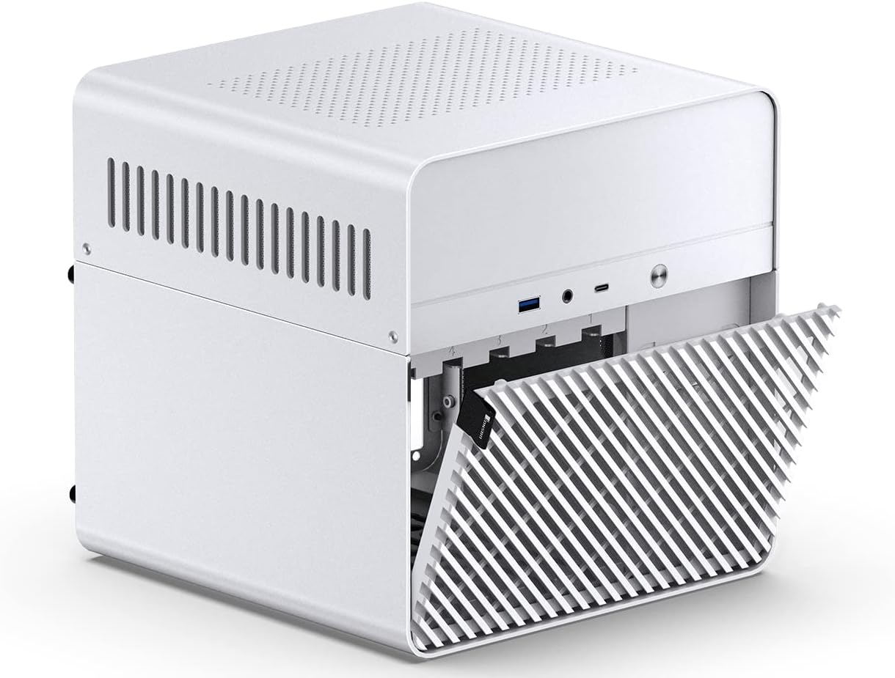
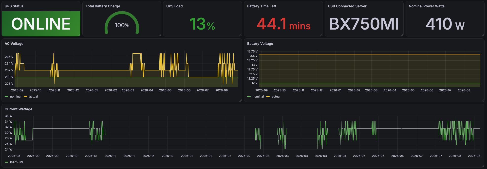
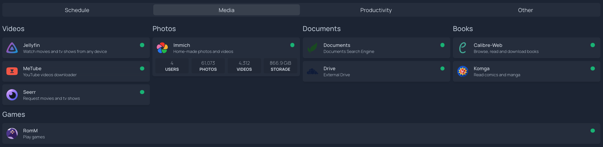
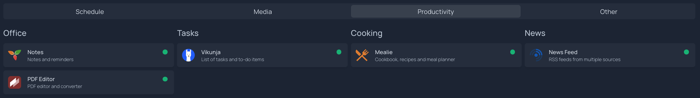
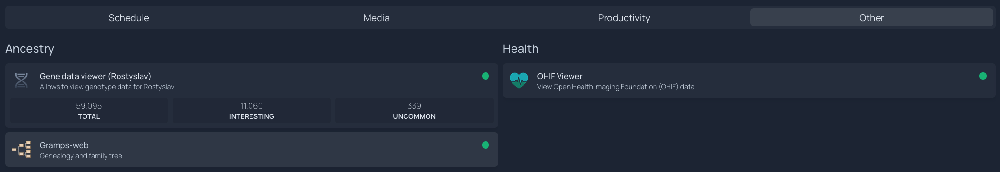
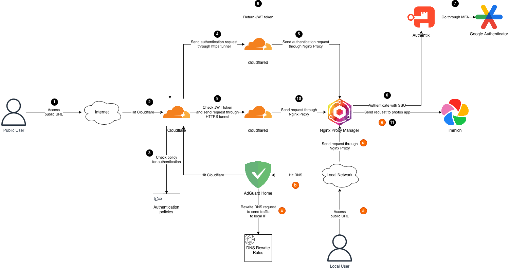
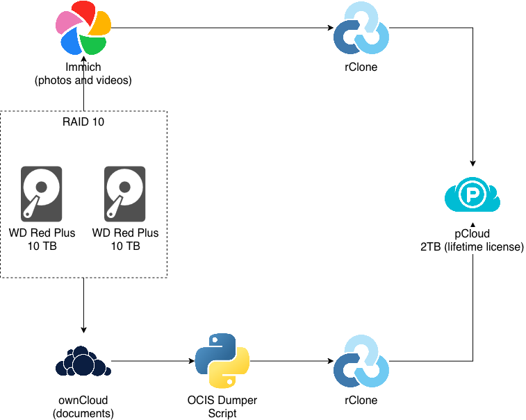
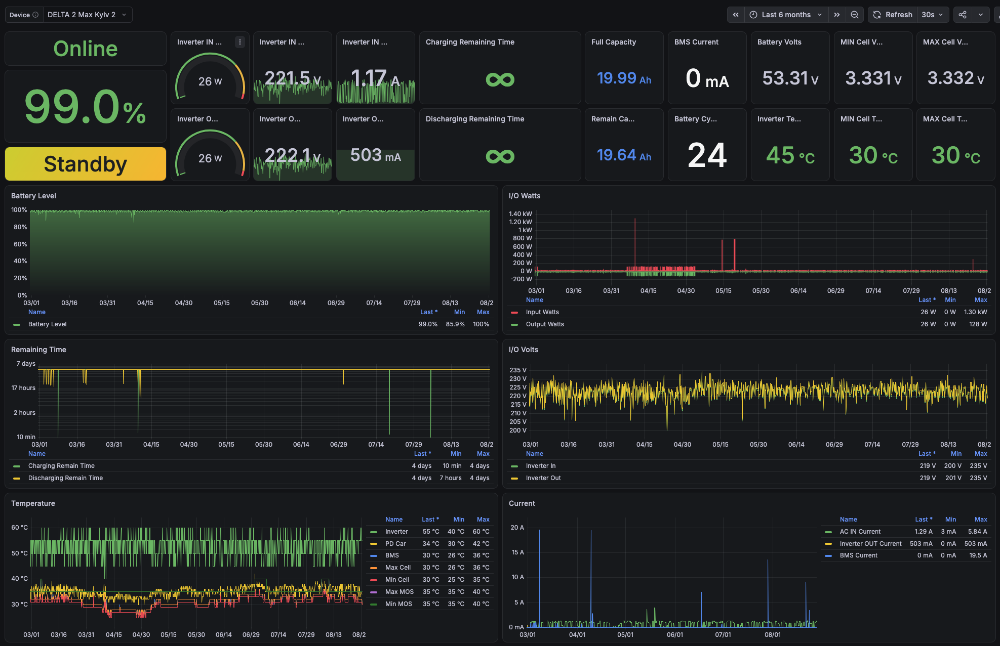

This started as a NAS. A Synology replacement, specifically. I wanted more control over my storage, didn't want to pay the Synology tax on hardware, and figured I'd build something myself. I followed [Brian Moses' DIY NAS 2025 guide](https://blog.briancmoses.com/2024/11/diy-nas-2025-edition.html) as a starting point, adapted it to my needs, and built the thing. Brian has since published a [2026 edition](https://blog.briancmoses.com/2025/11/diy-nas-2026-edition.html) as well, worth checking out if you're considering a build.

That was the plan. What I ended up with is a personal server that runs my photos, my documents, my media, my passwords, my notes, my tasks, my recipes, my DNS, my genealogy tree, my retro games, my medical imaging, my genetic data, and a few dozen other things. It consumes about 31.5 watts. It's smaller than my UPS.

## Table of contents

## The hardware

The whole server lives in a **JONSBO N2** case, a white cube roughly 22x22x22 cm. Inside:

- **Topton N18 N100 NAS motherboard** (Intel N100, fanless-capable)
- **32GB RAM**
- **2x WD Red Plus 10TB** in a mirrored configuration
- No GPU, no unnecessary fans, practically silent

The entire setup, server plus WiFi router plus ISP modem, pulls around 31.5 watts measured from the APC UPS via Grafana. It's been running for months at that level without drama.

Brian's guides cover the build philosophy well. I picked the N100 because it's cheap, low-power, and has hardware transcoding support (useful for Jellyfin). The JONSBO N2 fits five 3.5" drives in a package small enough to sit on a shelf and forget about.

## The software

TrueNAS SCALE is the base OS. On top of it, everything runs as Docker containers. At last count I have about 70 of them. Here's what they do, organized the way my homepage dashboard shows them.

### Media

- **Jellyfin** for movies and TV series
- **Immich** for photos and videos (61,000+ photos, 4,300+ videos, 866 GB). This is our Google Photos replacement for the whole family.
- **Calibre + Calibre-Web** for ebooks
- **Komga** for comics and manga
- **RomM** for retro gaming
- **MeTube** for downloading YouTube videos
- **Seerr** for movie/TV requests (the family can request things, I approve them)
- **Sonarr, Radarr, Lidarr, Bazarr** for media automation

### Productivity

- **Trilium Notes** for note-keeping
- **Vikunja** for task tracking
- **Mealie** for recipes and meal planning
- **Stirling PDF** as an Adobe Reader replacement (PDF editing, merging, splitting)
- **FreshRSS** for RSS feeds
- **OCIS (ownCloud Infinite Scale)** with **Collabora** as a local Google Drive + Docs alternative
- **Paperless-ngx** with paperless-ai for document OCR and automatic tagging
- **Jelu** for book tracking

### Health and personal data

- **[OSGenome](/posts/making-sense-of-my-dna/)** for genetic data viewing
- **[OHIF Viewer + Orthanc](/posts/looking-inside-the-disc-your-radiologist-gives-you/)** for medical imaging
- **[Lowenstein Prisma Viewer](/posts/what-my-cpap-machine-knows-about-me/)** for CPAP sleep data
- **Gramps-web** for the family genealogy tree

### Infrastructure

- **AdGuard Home** for network-wide ad blocking and DNS filtering
- **Authentik** for SSO across all services (with MFA via Google Authenticator)
- **Vaultwarden** as a self-hosted Bitwarden replacement
- **Nginx Proxy Manager** for reverse proxying all services
- **Cloudflare Tunnels** (cloudflared) for external access
- **Prometheus + Grafana + node-exporter** for monitoring
- **Homepage** for having everything at a glance
- **Syncthing** for file syncing between devices
- **ClamAV** for virus scanning
- **Portainer** for container management
- **Baikal** for CalDAV/CardDAV (contacts and calendars)

## External access without a static IP

My ISP doesn't give me a static IP. Actually, I don't even get a dedicated IPv4 address. The solution is **Cloudflare Tunnels**: a `cloudflared` container maintains an outbound connection to Cloudflare, and Cloudflare routes my subdomains through that tunnel to my local Nginx Proxy Manager, which then routes to the right container.

For authentication, **Authentik** sits in front of everything that's exposed externally, providing SSO with MFA. Locally, **AdGuard Home** does DNS rewriting so that requests to those same subdomains resolve directly to the local IP, skipping the Cloudflare round-trip.

The result: I can access everything from anywhere with proper authentication, and from inside the house it's fast because DNS sends me straight to the box.

## Backups: aiming for 3-2-1

I aim for the 3-2-1 backup strategy (three copies, two media types, one offsite), though I'm not strictly there yet.

- **Local storage**: two WD Red Plus 10TB drives in a mirror (RAID 10 in TrueNAS)
- **Offsite**: **pCloud** (EU-based, 2TB lifetime license), synced via **rClone**

Photos and videos from Immich go to pCloud via rClone. Documents from OCIS get exported through an OCIS dumper script, then rClone pushes them to pCloud as well. If the house burns down, the important data survives in a European data center.

The gap: the mirror protects against a disk dying, and pCloud protects against losing the box entirely, but I don't have a true third independent copy that would catch accidental deletions before they propagate to the cloud sync. A local USB backup or a versioned snapshot would close that gap. Room for improvement.

## Decisions and tradeoffs

I tested alternatives for most of the core services before settling. A few picks that might save you time:

**Immich over PhotoPrism.** I ran both. Immich is significantly more feature-rich: duplicate detection, AI-powered tagging, contextual photo search (genuinely impressive, you can search "beach sunset" and it finds the right photos), and face recognition. It also organizes files on disk by year/month/date, which makes backups straightforward. And when you edit metadata, Immich writes a sidecar file rather than modifying the original. Your source photos stay untouched.

**OCIS over Nextcloud.** Speed. It's not even close. OCIS is written in Go, Nextcloud is PHP. The architecture is completely different too: OCIS is modular and Docker-native, where additional functionality ships as sidecar containers rather than plugins bolted onto a monolith. Nextcloud has a bigger community and more integrations, but for a file sync + collaboration setup, OCIS with Collabora is faster and cleaner to operate.

**Authentik over Authelia.** Authentik is more complex to set up, but gives you more power once it's running. Full identity provider with user management, application-specific policies, MFA enrollment flows, and a proper admin UI. Authelia is simpler and lighter if all you need is a forward-auth proxy, but I wanted the full SSO experience across all services, and Authentik delivers that.

## Migration: leaving Google

Getting 61,000+ photos out of Google was less painful than expected. I used Google Takeout for the bulk export, which gives you a messy pile of zip files with JSON metadata sidecar files. Imported those into Immich, then pointed Immich at the other sources too: Amazon Photos (another export), and a scattering of USB drives with years of photos on them. Immich's duplicate detection handled the overlaps. After a few rounds of imports and deduplication, everything was in one place.

Google Drive to OCIS was harder. I tried a few automated approaches (uppy-companion, for example) and none of them worked cleanly. Maybe misconfiguration on my part, maybe the state of OCIS at the time. In the end I took the boring route: installed the Google Drive desktop app to get a local copy, then uploaded to OCIS through its web interface. Not elegant, but the data is there.

## Family adoption

This was the hardest part and has nothing to do with technology. New app on the phone, new app on the SmartTV, explaining how to access things, "why can't I just use Google Photos anymore." The initial pushback was real.

But after the growing pains settled, it stuck. Now the whole family uses Immich, including grandmas who just want to see photos of their grandchildren. Seerr works well too because the interface is simple: search for a movie, click request, I get a notification and approve it. They don't know or care what happens behind that button.

It has to be at least as easy as what you're replacing, or people won't switch. Immich and Seerr clear that bar. Some services (OCIS, Paperless) are still mostly just me.

## What broke

Plenty. 70 containers don't just run forever without issues.

The most annoying one: I postponed an Immich update for too long. When I finally went to upgrade, they had migrated to a new PostgreSQL version twice in the meantime and had already dropped the migration script from the oldest version I was on. I had to do incremental upgrades through intermediate versions to get to current. Update regularly; don't let containers fall behind.

My strategy for limiting blast radius: every container's persistent data lives in its own TrueNAS dataset, not in the default `ix-volumes`. This means if a container breaks badly or an app gets removed, the data doesn't disappear with it. It's a small upfront discipline that has saved me more than once.

## The cost comparison

Rough math on what this replaces:

| Service                | Monthly cost                                              |
| ---------------------- | --------------------------------------------------------- |
| Google One 2TB         | €9.99                                                     |
| Netflix Standard       | €13.99                                                    |
| Evernote               | €6.65                                                     |
| LastPass               | €2.90                                                     |
| Adobe Acrobat Standard | €17.99                                                    |
| **Total**              | **~€51.52/month, €618/year**                              |

Hardware costs (one-time):

| Item                                    | Cost               |
| --------------------------------------- | ------------------ |
| NAS build (case, motherboard, RAM, SSD) | ~€500              |
| 2x WD Red Plus 10TB                     | ~€500              |
| APC UPS                                 | ~€80               |
| pCloud 2TB lifetime license             | ~€270 (discounted) |
| **Total**                               | **~€1,350**        |

At €51.52/month in replaced subscriptions, the hardware pays for itself in about 2.5 years. That's not counting the services I never paid for but now have (media automation, retro gaming, genealogy, medical imaging, genetic data). I never actually paid for Adobe Acrobat either, but I always needed PDF editing and worked around it with clunky free tools. Stirling PDF fills that need now. The ongoing cost is just electricity: about €8-9/month at German rates for 31.5W continuous.

## What I actually monitor

Prometheus + Grafana + node-exporter are running, but I'll be honest: I don't have elaborate alerting dashboards for the NAS itself. What I mostly monitor is:

- **Power outages at my mother's home in Ukraine.** She has a couple of EcoFlow batteries, and given the current situation there, knowing when power goes out and comes back matters. I have a custom Go exporter for that.

- **UPS status** for the server itself (the APC wattage graph above comes from this)
- **Wireguard usage** for VPN connections
- **General server health**: CPU, memory, disk, container restarts

The server itself is stable enough that I mostly check dashboards when something feels slow, not because alerts fired.

## How it grew

What started as "I want to replace my Synology" is now a full-blown personal server with over 70 containers covering media, productivity, health, security, and infrastructure. The Synology could do a fraction of this, and only with proprietary apps. Most cloud services I was paying for (Google Photos, Google Drive, various SaaS tools) have open-source alternatives that run fine on modest hardware. No GPU needed, and I own the data.

If you've been thinking about self-hosting but it seems overwhelming: start with one thing. For me it was storage. Then I added photos, then media, then documents, and each one made the next easier to justify. Most of the services run as TrueNAS community apps (one-click install, automatic updates), and anything not in their catalog I run through Portainer.