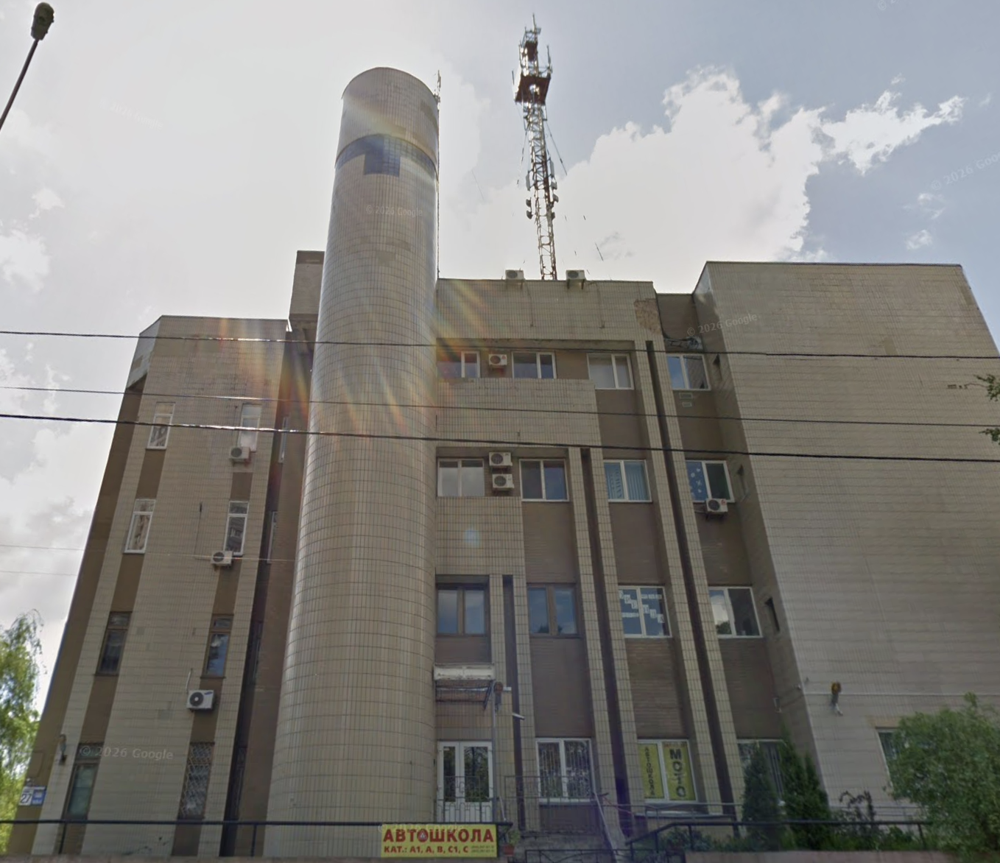

This one isn't a how-to. There's no architecture to defend, no lesson I'm building toward. It's a set of war stories from a job I had when I was much younger, in a different country, in a different line of work than I'm in now. Some of them I've told so many times that friends can finish them for me. I want to write them down before I sand the edges off any further.

The company was a mobile carrier called CDMA Ukraine. It doesn't exist anymore. I can't prove the two facts are related, but after you read this you may have a theory.

## Table of contents

## The legend I inherited

I joined with another engineer, Eugene, to run the core IP network. Before us, that network had exactly one author: a man named Peter.

Peter is a figure of mythical proportions, and I mean that as a compliment and a warning in equal measure. Over eleven years he built the entire core and designed the carrier network essentially by himself. He also kept all of it in his head. There was no documentation. Not "sparse" documentation. None.

Then Peter and the company's CTO went cycling together on a highway, and a car hit them. They both survived, thankfully, but Peter spent half a year in the hospital. For those six months, nobody could touch the network. The monitoring team could watch the alarms light up and do precisely nothing about them, because the only person who held the keys, literally and figuratively, was in a hospital bed.

When the dust settled, the CTO left. The company hired a new one. And Peter decided he was done too, but first he took a vacation. He hadn't taken any vacation in eleven years, so he took all of it at once: six more months.

So the new CTO's plan for the nation-wide core network of a mobile carrier was to hire two engineers to run it. We were twenty-two. I'd graduated the year before, this was my second networking job, and I already had a CCNP. None of which is the same thing as experience.

## Two weeks of thumb-twiddling

Peter was on vacation. Nobody else understood the network. What we were handed on day one was a monitoring system, [The Dude from MikroTik](https://mikrotik.com/thedude), that showed us the switches in the capital city and nothing else.

Access to any of it? None. Nobody knew the credentials.

So for two weeks we mostly waited. We found an unused server, put FreeBSD on it, and poked at it to feel like engineers. I wandered the server room and stared at the so-called monitoring. There's a hard limit on what you can do to a network you can't log into.

## The handover

Then, one day, Peter came to the office.

A lot of my stories from this job begin with that exact sentence, and I've come to love it. "One day Peter came to the office." Whatever followed was never boring.

I ran up to him like the eager twenty-two-year-old I was and asked for access to the equipment so I could actually start. He looked at me with a glint in his eye that I'd learn to recognize, and said he'd give me the core router. From there I could find every other credential myself.

What a handover. And it worked, because Peter ran no AAA system for device access at all. AAA, authentication, authorization, and accounting, is the machinery that normally decides who may log into a device, what they're allowed to do, and keeps a record of it. The usual setup gives each engineer their own account against a central directory. Peter's version was simpler. Every device had the same login: `peter`. There were three passwords, which I'll list in ascending order of security, exactly as he ranked them: `ass`, `ass2`, and the flagship, `ass2ass`.

Armed with this sacred knowledge, I set off to understand the network I was now responsible for.

## "BGP is all the rage now"

The first thing I found, once I could log in, was the network's interior routing protocol, and it was BGP. eBGP, specifically. On an AS number that didn't belong to us. Using external IP addresses that also didn't belong to us.

For the non-network readers: eBGP is the protocol that stitches the different networks of the internet together, between organizations. Using it as your internal routing protocol, inside one company, on someone else's AS and someone else's addresses, is a bit like registering your house on a stranger's street address and then wiring your intercom through the national phone exchange.

One day Peter came to the office. I asked him what this was about. He kept a perfectly straight face and said, "Didn't you hear? BGP is all the rage now. I wanted to try it." Then he walked off and left me trying to pick my jaw up off the floor.

Being responsible engineers, Eugene and I decided to migrate the interior to OSPF. We took a maintenance window, always at night when the load was lowest, and designed it by the book: multiple areas, route aggregation, the works. We flipped the protocols overnight.

Around 7 AM we were back in the office, tired and pleased with ourselves, when the CTO came running in to say the internet was down. I checked. I could browse fine, and told him so. No, he said, the mobile internet, the one for customers, was down.

That was the morning I learned we provided mobile internet to customers. Remember, no documentation. We got it working on the new routing, but I still think about the gap between "we finished the migration" and "we found out what we'd migrated."

## One router, three loops, no manual

The next thing I found was the switches, the same 150 the monitoring showed, all hanging off a single router.

How do you hang 150 switches off one router without the whole thing collapsing into a broadcast storm? Through what I can only call Peter's ingenuity. There were three physical loops in that switching layer, all in the same broadcast domain, each held down by a different technology: plain STP on one, MSTP on another, and Huawei's proprietary RRPP (Rapid Ring Protection Protocol) on the third.

Sit with that, because it's worse than it sounds. One broadcast domain is one bridged graph. STP, or MSTP, builds a single spanning tree across the whole thing; it has no notion of "just this loop," it looks at all the redundancy it can see and blocks ports until the topology is loop-free. RRPP, meanwhile, sits on its own ring, built from links that live in that same domain, making its own independent decisions about which port to block. So all three schemes were reaching into one shared topology, each deciding on its own terms which links to cut. This is exactly the situation [Huawei's own guides tell you to avoid: disable conflicting protocols like STP on a ring before you turn on RRPP](https://support.huawei.com/enterprise/en/doc/EDOC1100213107/51944105/example-for-configuring-a-single-rrpp-ring-with-a-single-instance).

It didn't take the network down, and that's the unsettling part, not the reassuring one. It held because the three of them happened to settle on a set of blocked ports that didn't contradict each other. That's not a design, it's an equilibrium. One link flap, one reconvergence, one switch reboot at the wrong moment, and two of these protocols could disagree about which port owns the block. Then you get either a port nobody blocks, which is a loop and a broadcast storm, or a port everybody blocks, which is a black hole. The whole arrangement was one topology change away from either. It was fun to look at and impossible to manage, and untangling it into something a human could safely reason about took us about a year.

## The rack I was told not to breathe on

In the server room, one rack stayed a mystery. Two switches at the bottom, and above them equipment I couldn't identify. I couldn't log into the switches either. For the first and only time, not even `ass2ass` worked.

One day Peter came to the office. I asked about the rack. He looked me dead in the eye and told me it was extremely important, that I must not touch it, must not even breathe in its direction, because if I did, everything would break.

Fine, I thought. I left it completely alone.

The next day I went to the server room and every device in that rack was powered down. It never came back on. To this day I have no idea what ran there. Nothing seemed to miss it.

## The Cisco that wasn't supposed to exist

I spent a long stretch mapping the network by hand. I'd walk the server room, plug a console cable into each device, read its neighbors off LLDP, and add it to a diagram. Slowly a full picture came together.

Everything was Huawei. Everything except one stubborn MAC address that kept announcing itself as a Cisco device I could not find anywhere in the room.

One day Peter came to the office. I asked. Oh, that one's not needed anymore, he said, you can safely shut it down. It's in the server room on the fourth floor.

Our server room was on the third floor. That was the day I learned we had a second one, on the fourth.

I went straight up. The room was a dumpster: cardboard boxes everywhere, dead CRT monitors on the floor, loose keyboards and mice, the whole graveyard. Across the room stood a nearly empty 42U rack with a Cisco switch at the bottom and some server at the top. I made for the switch, laptop in one hand and console cable trailing, stepping over monitors, my free hand out for balance.

I put that hand on a big cardboard box and felt it trembling. For a second I genuinely wondered if I was having a stroke. I looked at my hand: steady. I touched the box again: still trembling. So I lifted it. Underneath was a three-legged stool, and on the stool sat a running server, the flat rack-mount kind meant to be bolted into a rack, balanced on the stool instead, its monitor and keyboard and mouse splayed on the floor around it.

But I was on a mission. That switch had been bothering me for weeks. I filed the humming stool-server under "deal with later" and kept going.

So there I am, on the floor next to a Cisco switch, and I hadn't touched a Cisco device in ages, because everything at this company was Huawei. Rather than just shut it off, I decided to play a little, disable some ports, get reacquainted. It wasn't needed anymore, right?

Ten minutes later Peter came barging in, shouting that everything had failed and I needed to revert immediately. I opened my mouth to remind him it wasn't needed. He cut me off: stop arguing, revert. Then he left.

What I pieced together afterward: that Cisco switch connected to the server at the top of the rack, and that server was the AAA server for every mobile internet customer in the company. And later still, that it had no backup power, so some nights it simply switched itself off.

We fixed that. Eventually.

## The eleventh switch

One day Cyril, the system administrator, asked for help with the office network. I told him I ran the core IP network and had no idea how the office network was wired. He said, "Peter built the office network." That got my attention.

We went to the fourth floor, not to the server room this time, but to a storage room. Inside was what I think was a 10U rack, though I couldn't actually see it. It was buried under a jumble of cables, cables on the frame, cables spilling onto the floor.

I stepped in for a closer look and tripped on something under the pile.

Peter had figured ten switches would be enough, so he bought a 10U rack. Ten was not enough. The eleventh switch was simply lying on the floor, hidden under the cables, still running. That was the thing I tripped over. Another one for the fix list.

## Pull-ups on the cable ducts

Peter was a legend to the old hands, too. Cyril, who'd worked with him, told me Peter liked to come in at night, when it was quiet and he could focus. And, Cyril added, Peter used to do pull-ups on the server room's cable ducts.

I called bullshit. Cyril said, roughly, hold my beer. Now, Cyril was built heavier than Peter. He jumped, caught the duct, and it folded in half under him.

That, too, was a fun fix.

## The pigeon in the wall

Peter's desk sat right beside the server room. After he left, the room was repurposed for the operations team, sensible, close to the equipment. Peter never really cleared out. Posters stayed on the walls, odds and ends stayed on the desk. Operations left the walls alone.

I never expected to write the sentence I'm about to write. It belongs on r/BrandNewSentence. Bear with me.

One day, a pigeon fell into the wall.

The building was an old Soviet-built cross-connect station, narrow windows, hollow walls.

_The building where all of this happened, a real place you can [find on the map](https://maps.app.goo.gl/tkSCFLDEgkFgm8zd6)._

A pigeon got into the cavity near Peter's old desk and started cooing inside the wall. The operations team worried, first for the pigeon, and second, more practically, about what a dead pigeon sealed inside a wall would eventually smell like.

So they decided to break the wall open. They pulled down Peter's old posters, and behind one was a hole already there. Very Shawshank. The only explanation any of us could come up with: at some point in his eleven years, Peter had had the exact same pigeon-in-the-wall situation, broken through to deal with it, and then quietly covered the hole with a poster. They got the pigeon out.

## The printer that anyone could reach

A while after we'd moved to OSPF and rolled out real AAA on the switches, to make sure no `peter` logins survived, I got a call from our call center. The call center was in another city and handled end users.

Out of nowhere they told me a customer had just phoned in to apologize for printing on our office printer.

I felt my hair start to grey on the spot. First, how? Second, this is a security hole of comical proportions.

I dug in. Peter either didn't believe in VPNs or couldn't be bothered, so he'd wired things such that when he dialed in over the 3G modem for mobile internet, he landed straight inside the office and core networks. So could anyone else. Combine that with passwords like `ass2ass`, and the honest answer to "how were we never hacked" is that I don't know. Another fun fix.

## The morning nobody could make a call

Not all of the fun was Peter's doing. Some of it was ours, and this one was ours.

Eugene, the other twenty-two-year-old I was hired with, was genuinely good, and he's a serious professional now. But we were young. One night it was his turn on the maintenance window. He did the work, it didn't pan out, so he reverted it, sent us an email saying so, and went home. Textbook, up to that point.

I got in around 9 AM to find people running around the office. The operations team and the base station controller team were huddled together trying to work something out, and someone asked whether I might know what was going on, because they had a "tiny" issue. The tiny issue was that 99% of calls weren't connecting. In a mobile carrier. Nobody could make a phone call.

I said what I always said: I work on the core IP network, I'm not sure how I can help. They agreed and went back to running around. But something itched, so I decided to check, just in case. I opened The Dude, looked around, and there it was: one link between two switches carrying gigabits of traffic that had no business being there. I went to the switch, and sure enough, a loop. I shut the port and everything came back to life.

Here's what had actually happened. My colleague finished his real work, reverted it like a responsible person, and then, riding a little spike of late-night enthusiasm, made an unrelated change nobody had asked for and nobody was told about. That change was the loop. So the reverted maintenance was fine; the freelance bonus round was what took the phones down.

We had a talk about scope after that. Gently. I'd have done the same thing at that age, and probably did, elsewhere.

## The boot

One more of ours, and this one left a mark. Literally.

The stool server, the one that had been humming away under a cardboard box, needed to move to the server room on the third floor. So Eugene, Cyril, and I set out to carry it. Three of us, one rack server, what could go wrong.

We were, it turns out, the Three Stooges. We barely got it off the ground before some awkward pivoting and a bit of "you go left, no, my left" ended with us dropping it. The server came down rails-first, and the metal guide rails on its side went straight through my boot. I felt it coming and curled my toes just in time, so the rails punched through the leather on either side of them instead of through me.

My workday ended at that exact moment, because I left to buy new boots. It was a cold Ukrainian winter, and a cold winter is not the season to walk around with two neat holes in your boot.

## Doing the night work during the day

We ran 3G mobile internet, which meant PDSNs scattered around the country. As traffic grew, we bought a bigger, more powerful one, racked it in our server room, and planned the migration. I'd do the cutover at night, so I prepared during the day.

Preparation meant, first, being able to see the equipment at all. No documentation, and Peter had deployed the switches across Ukraine configured as unmanaged despite the hardware supporting management. No monitoring, no remote access.

So I was on the phone with a technician standing in a remote data center, walking him through it. Take the patch cord out of this switch port, move it to a management port, so I can give the switch an IP and pull it into monitoring. It went smoothly, right up until he moved a patch cord somewhere and everything went down. I knew from experience that meant a loop, so I asked him to put the cord back in the previous port.

Over the phone I heard: "I don't remember where it was."

I did the night work during the day, that day.

The last of these switches I found, in a remote region, turned up eighteen months after I started. The last I found, not the last there was. I never had any way of knowing I'd tracked down all of them. There may still be a switch somewhere in Ukraine, unmanaged, quietly running, that I never knew existed. Fun times.

## No moral, as promised

I told you at the top there wasn't a lesson in this, and I meant it. If you want one anyway, "write documentation" and "don't set your password to `ass2ass`" are both right there for the taking. Peter had eleven years to notice either one and never did.

Here's the thing I keep coming back to, though. Every one of these stories is me finding something absurd, and every one of them is also a thing that _worked_, or worked well enough, for years, run by one person who never wrote any of it down. I spent my first eighteen months undoing it, and I was a little smug about that at the time. I'm less smug now. Peter built a nation-wide network by himself and carried the whole thing in his head, and the reason I have these stories at all is that he pulled it off long enough for me to walk in and be baffled by it.

I hope he enjoyed his vacation. All twelve months of it.
