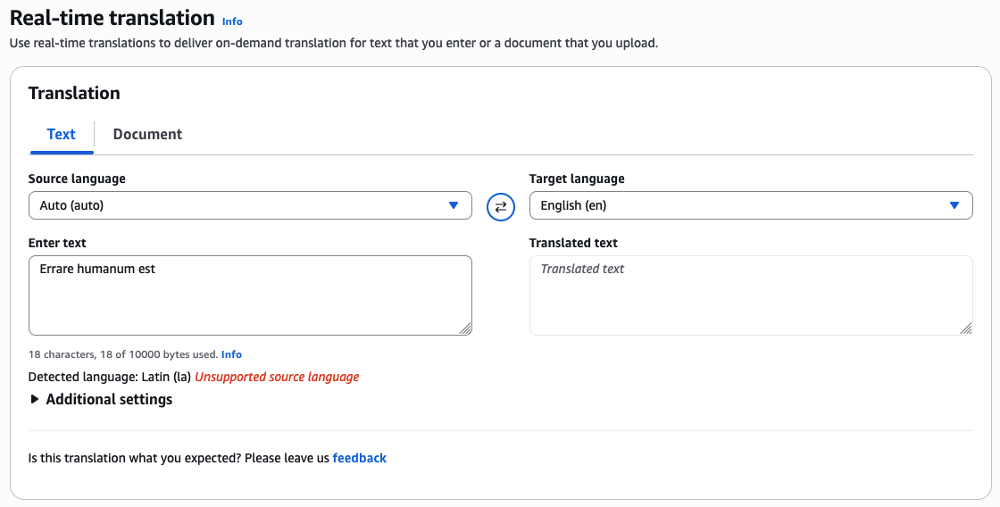

In [Designing agentic AI on Bedrock](/posts/designing-agentic-ai-on-bedrock) I described a support-ticket classifier that shrank from a $145k-a-year mega-prompt to a $744-a-year deterministic pipeline. That post was about one box: the thing that reads a request and assigns labels. This post is about everything that has to happen _before_ that box, because classification is the last step, not the first.

Reading a customer request sounds like the easy part. You call a managed service, it hands you clean text, and you get on with the interesting work. That is how it goes in the demo. But those services were built for the average input, and customer support mail is not average. It is long, threaded, multilingual, wrapped in HTML, and signed off by a legal department. A service that works perfectly in the console does something confidently wrong on a real email.

What follows is four of those traps, in the order the pipeline hits them. None is exotic. All of them cost me time I'd like back.

## Table of contents

## The shape of the pipeline

Here's an approximation of the pipeline, with the confidential parts removed. A request arrives, its text is extracted if it came in as a document, its signature is stripped, and then it fans out to the enrichment steps that produce the labels, summaries, and scores downstream systems consume.

The split that matters is left versus right. The steps on the left, text extraction and signature removal, are preprocessing. They don't produce anything a human sees; they exist so everything to their right works from clean input. Every trap below is a downstream service inheriting a mess a preprocessing step should have caught. Get the left side wrong and the right side fails in ways that look like the right side's fault.

Each trap has the same shape: a managed service reads the input, returns a plausible answer, and the answer is wrong.

## Trap 1: the signature stuffs the language ballot

The first thing the pipeline needs to know about an email is what language it's in. Everything keys off that answer: which translation direction to use, which sentiment model, which sentence tokenizer. Amazon Comprehend's `DetectDominantLanguage` gives it to you in one call. Feed it text, it tells you German, English, or Korean, and you route accordingly.

Except a lot of corporate email isn't one language. Picture a three-sentence reply written in English, the actual message, sitting on top of a corporate signature block that runs longer than the message itself, in German, with the full legal entity name, the postal address, the board of directors, and a confidentiality notice. To a detector that works by counting, that email is overwhelmingly German. The signature outvotes the message. Comprehend returns German, and now an English email is treated as German by every step after it: the translation is nonsense, the sentiment is scored against the wrong language, the classification drifts.

The word "dominant" is carrying the whole problem. Comprehend is not wrong; by volume the email _is_ mostly German. It answered the question it was asked. That question just wasn't the one I needed answered.

The fix is simple to state and fiddly to build: **strip the signature before you detect the language.** If the boilerplate never reaches Comprehend, it can't stuff the ballot. That's why signature removal sits upstream of everything in the diagram, not as a tidy-up at the end.

### How the signature detector works

There's no managed service for "remove the signature from a multilingual email thread," so I wrote one. It stacks a few cheap techniques, cheapest first, and stops as soon as one produces a clean cut. It supports fourteen languages, because our mail does.

1. **Pull the latest reply out of the thread.** Customer mail is rarely a single message; it's a reply on a reply on a forward. A reply parser extracts just the most recent message so the detector isn't wading through quoted history.
2. **Bail early on the easy cases.** If the message starts with a special character or is a single sentence, there's no signature worth chasing, so it's returned untouched. Signatures live at the bottom of multi-sentence messages.
3. **Strip bracketed lines.** Lines wrapped in angle or square brackets (quoted headers, `<mailto:>` fragments, metadata) go first.
4. **Ask NER whether the last sentence is a name.** The last sentence is run through a spaCy model for the detected language, checking for a `PERSON` entity. "Best regards, Klaus Bergmann" ends in a person; a genuine closing sentence usually doesn't. If it's a name, it's dropped.
5. **Match sign-off patterns.** Finally, a per-language set of regexes for the phrases people actually close with (`mit freundlichen Grüßen`, `kind regards`, `cordialement`, `з повагою`), plus the company's own boilerplate legal footer. Everything from the first match onward is cut.

It returns the first non-empty result from that cascade and cleans up the leftover blank lines. The layering earns its keep: NER catches the bare-name sign-offs no keyword list would, and the keyword pass catches the formal closings and the legal block NER ignores. Neither was good enough alone; together they clear the vast majority of real mail.

> [!NOTE]
> Language detection here is circular, and you have to make peace with it. You need the language to pick the right spaCy model and tokenizer, but the signature is the thing corrupting language detection. The resolution: detect on the raw text just well enough to strip the signature, then let the _routing_ language detection run on the cleaned text. The detector's own guess only has to be good enough to remove the signature, not good enough to route on.

> [!TIP]
> Keep the company's legal footer as its own explicit pattern, separate from the polite sign-offs. Sign-offs vary by person and mood; the corporate boilerplate is byte-for-byte identical on every email and is the single most reliable thing to match on. It's also the worst offender for the language problem, because it's long and always in the head-office language.

## Trap 2: you can't just translate the HTML

With a clean, correctly detected message, the next job is translation, so the rest of the pipeline and the human agents can work in one language. And the inbox has another surprise waiting.

Real email is HTML. Almost every mail client sends it: `
`s, inline styles, ``s wrapping half a sentence, `<a>` tags in the middle of a clause. So the obvious move is Amazon Translate's document translation, advertised to accept an HTML file and hand back a translated HTML file with the markup intact. It has a restriction that isn't obvious until you hit it: **document translation requires English on one side.** Either the source or the target language has to be English. You cannot translate a Czech HTML document straight to Chinese.

For an English-plus-German shop that would be survivable. For a support desk that receives mail in a dozen languages and often needs to move between two of them that aren't English, it's a wall.

I raised it with AWS. The official recommendation was to translate the document twice: source to English, then English to target. Route every email through a pivot language, pay for two passes, and let the round trip degrade the text a little more each hop. I'm not routing every customer's German through English and back to get it into French.

They also filed an internal feature request. Maybe it ships, maybe it doesn't; either way I couldn't wait on it with tickets piling up.

So I wrote my own HTML translation service. The idea is small: parse the HTML, translate the text, leave the tags alone. The care is in the implementation.

It parses the document with BeautifulSoup and walks every text node. Non-visible nodes are filtered out (`script`, `style`, `head`, `title`, `meta`, comments, stylesheets), and, reusing the signature logic from Trap 1, so is any node inside a container whose `id` or `class` mentions "signature." Each surviving text segment is recorded against a stable index, translated on its own, and then written back into the exact node it came from with an in-place replace. The tags are never touched, because the translator never sees them; it only ever sees the strings between them. Reconstruct the soup and you get the original document, structure and styling intact, with only the human-readable text swapped out.

It's BeautifulSoup, a dataframe, and a translate call per segment, nothing more. But it does the one thing the managed service wouldn't: translate between any two supported languages while preserving the markup. And "per segment" turned out to hide a landmine.

## Trap 3: it detects languages it can't translate

Translating each text segment on its own means calling Amazon Translate with auto-detect on hundreds of little fragments per email, some of them a single word or an abbreviation. Most of the time that's fine. Occasionally the pipeline stopped dead on a segment that looked completely ordinary.

The cause is a mismatch nobody advertises: **Amazon Translate detects more languages than it can translate.** Auto-detect is backed by Comprehend, which recognizes a long list of languages. The translation engine supports a shorter list. When detection lands on a language in the gap between those two lists, you get a confident detection followed by an `UnsupportedLanguageException`, and the translate call fails.

The one that bit us was Latin. Short, formal, abbreviation-heavy fragments, the kind you find in a legal footer or a product name, get detected as Latin often enough to matter. Comprehend will happily name it; Translate refuses it. You can reproduce it in the console in ten seconds with a proverb everyone knows:

_Errare humanum est_, to err is human. The service errs by naming a language it then admits it can't handle. Fitting.

The fix is defensive rather than clever: the translation call is wrapped so any failure, whether an unsupported language, an unsupported pair, or a throttle, falls back to returning the original segment untouched rather than blowing up the whole document. A fragment that can't be translated stays in its source language, the other few hundred segments translate fine, and the email still comes through. A single misdetected abbreviation shouldn't cost you the entire message, and now it doesn't.

> [!NOTE]
> "Detects it" and "supports it" are two different capability lists on the same service, and the gap between them is invisible until a request lands in it. When you lean on auto-detect, assume the detector can hand your translator a language it can't accept, and decide up front what happens when it does. Silent fallback to the original text was the right call for us; failing loudly might be right for you.

## Trap 4: sentiment averages the arc away

The last trap is the one that justifies a step people always question: summarization. If you're routing tickets, why summarize at all? Why not feed the raw text to the classifier and the sentiment model directly?

Because of how customers actually write. A meaningful share of ours are German, and German customers with a long relationship to a premium car brand do not write short emails. A complaint often opens with the entire history of the relationship before it gets anywhere near the problem. Paraphrased, with the brand left out:

> I bought my first car from you in 1998, at the dealership near the old market square, and it was a wonderful experience. The salesman remembered my name, and the service over the years was stellar. (Two more paragraphs.)
>
> In 2005 I bought my second car, this time across town, and again everything was excellent. (Four paragraphs about the car, the trips, the service visits.)
>
> My third car, in 2015, was brilliant. (Three paragraphs.)
>
> But the car I bought last year, at the dealership on the ring road, has been awful, and the service has been worse.

Everything the router needs is in the last sentence. Everything before it is warmth and context. Feed the whole thing to a sentiment model and it reads three glowing paragraphs and one sour one and calls the email mildly positive. That's backwards. This is an angry customer, and the anger is the part you have to act on.

So summarization earns its place by compressing the history down to the point while keeping the ending intact instead of averaging it out. The summary feeds sentiment, and sentiment comes out right because it's now scoring what the email is asking for rather than the fond memories wrapped around it.

## A detour through Azure

The four traps are all the same shape: a service returns a confident wrong answer, and the fix is upstream of it. Summarization was different. Not a wrong answer, a missing capability, and the way out was to leave the platform and come back.

Summarizing those emails needs a model with a big input window, because the whole thread has to fit in one call. Early on the in-house choice on Bedrock was Amazon Titan, and Titan's input limit was too small for the longest threads. A four-page reminiscence with a quoted history under it didn't fit.

So we went off-platform. We ran summarization on Azure AI Foundry for a while, with everything else still on AWS. It worked, but it also put a second cloud in the request path: another set of credentials, another bill, another place for latency and failures to come from. We treated it as temporary from day one.

Then AWS shipped the Nova models, the input windows were big enough for the long threads, and the reason for the detour was gone. We moved summarization back to AWS and pulled the Azure model out. No complaint about Azure; Foundry did the job while we needed it. The takeaway is about the seam: when a platform gap pushes you onto another cloud, treat that leg as a rental and keep it isolated enough that you can drop it when the gap closes. When Nova closed ours, dropping it was a small change.

## The through-line

Back to the traps, because they share a root. Each managed service did something reasonable for the average input and wrong for mine, and each time the fix lived _upstream_ of the service: clean the input, or wrap the call, so that by the time the request reaches the clever part it says what the customer meant. It's the same instinct as the [classifier post](/posts/designing-agentic-ai-on-bedrock) from the other direction. There the job was deleting machinery until all that was left was a vector store and a Lambda; here it's not trusting a managed service just because it hands back an answer.

A few things I'd pass on to whoever builds this next:

- Preprocessing isn't cleanup, it's correctness. Signature removal, text extraction, and language detection sit upstream, and everything downstream inherits their mistakes. A wrong language guess doesn't look like a bug; it quietly poisons translation, sentiment, and routing.
- A confident answer isn't a correct one. Comprehend calling a German-signed email "German," Translate calling an abbreviation "Latin": both are defensible, both are useless. Check the answer against what you actually needed to know.
- "Detects it" and "supports it" are different lists on the same service. Assume auto-detect can hand you a language the rest of the service won't accept, and decide up front what happens when it does.
- A platform gap sometimes forces you off-platform, as the Titan window did with us. When it happens, keep that leg isolated so you can drop it the moment the gap closes, the way we dropped Azure once Nova landed.
- When a managed service won't do the job, a small script often will. The HTML translator is BeautifulSoup and a translate-per-segment loop, and it does the one thing Amazon Translate refused to.

The classifier gets all the attention. It only works because the dull step in front of it hands over text that means what the customer meant. Reading what the customer actually wrote turns out to be most of the work.
