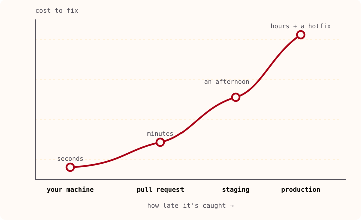

In November 2015 I stood in front of a conference room and gave a talk called ["Building better CI using Jenkins pipelines"](https://www.youtube.com/watch?v=QWGcat7JRk4). It was about taking the old, brittle way of wiring up continuous integration and making it better: a custom DSL for the pipelines, code review for the pipeline definitions themselves, everything in source control instead of clicked together in a web UI that nobody could reproduce.

I watched it back recently. The tooling is a museum piece. The argument I was making holds up completely.

## Table of contents

## A decade of different logos, one identical problem

Since that talk I've worked with, fought with, and been on call for a long parade of CI/CD systems. Jenkins. TeamCity. Bamboo. GitLab CI. GitHub Actions. ArgoCD, Flux, Spinnaker on the deployment side. Each one arrives with a new vocabulary, a new config format, a new set of opinions about how a pipeline should be shaped, and a marketing page explaining why it's different from the last one.

They are not different. Not where it counts.

Every one of them has the same problem underneath, and it's this: your end-to-end build and deployment time depends on how much cleaning and linting you already did on the developer's machine. That's it. That's the load-bearing sentence I've been repeating in one form or another for over a decade. The CI server is where slow, expensive, shared work happens. Every check you push back onto the laptop is a check the pipeline doesn't have to run, a failure the developer sees in seconds instead of after a ten-minute queue, and a class of bug that never reaches the shared branch to begin with.

You can't do everything locally, and you shouldn't try. Smoke tests, regression suites, real security scanning against real infrastructure, cross-service integration: that work needs the CI environment, and pretending otherwise just moves the pain around. But you can do a _lot_ more locally than most teams do, and every bit you move left makes the build faster and the shipped code more secure at the same time. It's one of the rare tradeoffs that isn't one.

So this post is the 2015 talk again, wearing 2026's clothes. Different tools, same idea. Let me show you what the idea looks like today, on a real project.

## The premise, stated plainly

A bug caught on the developer's machine costs seconds. The same bug caught in a pull request costs minutes. In staging it costs an afternoon. In production it costs a hotfix, an incident channel, and a postmortem.

Shift-left is just the decision to act on that cost curve instead of ignoring it. Move every check you can toward the moment the code is written, and let the expensive, slow, shared stages catch only what needs them. It isn't a methodology you buy, it's a decision about where to spend your attention.



The reason it's hard is operational, not conceptual. "Just run the checks earlier" means every contributor now needs the same checks, the same tool versions, and the same behavior regardless of which editor or operating system they use. That's the part that falls apart in practice, so that's the part worth being deliberate about.

## Layer 1: the developer's machine

This is the cheapest layer and the one with the highest return, because it runs before code ever leaves the laptop and costs nothing in CI.

We standardize pre-commit hooks across every repository. One checked-in config gives everyone the same checks: large-file detection, merge-conflict markers, AWS credential and private-key detection, JSON/YAML/XML validation, trailing-whitespace and end-of-file fixes, line-ending normalization, markdown linting, commit-message validation, and a hard block on committing straight to `main`.

Two details matter more than the list.

First, **ordering**. Hooks run fast-to-slow: quick file checks, then typo detection, then language linters, then the heavier Terraform tooling, then the commit-message check last. If a file still has a merge-conflict marker in it, there's no reason to run `terraform validate` before telling you. Fail fast means fail on the cheapest check that can catch you.

Second, **why hooks at all**, because this is exactly the fight I was having in 2015 about pipeline definitions, just moved one step earlier. IDE plugins are personal and unenforceable; your teammate on a different editor gets none of them. Custom git hooks live in `.git/hooks/`, which isn't versioned, so they can't be shared and you maintain the glue forever. Managed, version-controlled hooks are the same lesson as version-controlled pipelines: if it isn't in source control and reproducible for everyone, it doesn't really exist.

### prek over pre-commit

The usual tool is `pre-commit`, the Python one. I use [`prek`](https://github.com/j178/prek) instead, a Rust reimplementation that reads the same hook ecosystem but ships as a native binary. No Python runtime to babysit, parallel execution by default, much faster cold starts. Same guarantees, less waiting. And that speed isn't vanity: a check that runs on _every_ commit either stays fast or gets quietly disabled by the very people it's meant to protect. I've watched teams turn off hooks that took eight seconds. Make it instant and it survives.

### Same tools, same versions, via asdf

The other half of "works on my machine" is versions. If my `tflint` is one minor version ahead of yours, we get different results from identical code, and now we're debugging the linter instead of the bug. So versions are pinned in a checked-in `.tool-versions` file managed with [`asdf`](https://asdf-vm.com/):

```ini
checkov 3.3.5
ruff 0.15.20
terraform 1.15.7
terraform-docs 0.24.0
tflint 0.63.1
tfupdate 0.9.4
trivy 0.71.2
```

Run `asdf install`, get exactly what everyone else has, including the CI runner. Upgrading a tool is a one-line commit that moves the whole team at once. New people are productive in minutes instead of losing an afternoon reconciling versions. In 2015 the equivalent was a wiki page titled "how to set up your build environment" that was wrong within a month. This is that wiki page, except it's executable and can't drift.

## The linting stack

With the machinery in place, the checks themselves are just tools, chosen because they run fast locally and catch real problems. Grouped by what they look at:

**Terraform** gets the most attention, because infrastructure mistakes are the most expensive to unwind once they're live. `terraform fmt` for canonical formatting, `terraform validate` for syntax and types, [`tflint`](https://github.com/terraform-linters/tflint) for the AWS and Terraform rules `validate` misses (deprecated attributes and the like), [`checkov`](https://github.com/bridgecrewio/checkov) and [`trivy`](https://github.com/aquasecurity/trivy) for security and misconfiguration scanning with deliberately overlapping rule sets, [`terraform-docs`](https://terraform-docs.io/) to keep each module's README generated instead of hand-maintained, and [`tfupdate`](https://github.com/minamijoyo/tfupdate) to pin provider and Terraform versions so they don't drift silently between repos.

**Code** leans on [`ruff`](https://docs.astral.sh/ruff/), the core of the Python setup. One Rust binary replaces flake8, isort, Black, pydocstyle, bandit, and pyupgrade, running in milliseconds. One design decision here is deliberate: turn the security rules (Bandit's `S` category) on by default rather than opt-in, and relax the rules for test files, where `assert` statements and magic numbers are fine.

```toml
target-version = "py314"

[lint]
select = [
  "S",     # Bandit security
  "ANN",   # Annotations
  "B",     # Bugbear
  "I",     # isort
  "D",     # pydocstyle
  "PL",    # Pylint
  "UP",    # pyupgrade
  "PERF",  # Performance
  # ... 40+ categories
]
ignore = ["D203", "D213", "E501"]

[lint.per-file-ignores]
"tests/**/*.py" = ["S101", "PLR2004"]
```

[`shellcheck`](https://github.com/koalaman/shellcheck) and [`hadolint`](https://github.com/hadolint/hadolint) cover shell scripts and Dockerfiles. Hadolint embeds ShellCheck internally, so it lints both the Dockerfile directives and the shell inside your `RUN` commands. [`typos`](https://github.com/crate-ci/typos) catches spelling mistakes in source before they become a variable name you have to live with.

**Everything else**: [`actionlint`](https://github.com/rhysd/actionlint) for GitHub Actions workflows, [`markdownlint`](https://github.com/DavidAnson/markdownlint) for docs, [`commitlint`](https://github.com/conventional-changelog/commitlint) for commit messages.

`actionlint` earns a special mention because it illustrates the whole thesis. GitHub Actions has no native dry-run. Without a local linter the loop is: push, wait for the runner, discover you misspelled an action input, fix, push again. That's the exact slow feedback loop I was complaining about with Jenkins in 2015, just relocated. actionlint collapses it to a sub-second local check that catches invalid inputs, bad `uses:` references, expression type errors, and shell mistakes inside `run:` steps before any of it reaches the server.

### Conventional Commits

Commit messages follow [Conventional Commits](https://www.conventionalcommits.org/), enforced by commitlint in the pre-commit hook:

```
feat(api): add NER endpoint for German
fix(parser): handle empty email body
chore(deps): bump ruff to 0.15.20
```

Low friction, high payoff. The first benefit is easy to overlook: it forces developers to actually think about the commit message. The natural state of an unattended git history is `fix`, `fix2`, `debug`, `fix3`, `finalfix`, `finalfinalfix`, `finalfinalfix-for-real`, a stack of commits that tell you nothing about what changed or why. Conventional Commits makes that impossible. You can't type `type(scope): description` without first deciding whether this is a `feat` or a `fix`, and what part of the system it touched. The format does its real work before the message is even written. After that, the payoff compounds: `git log` becomes scannable at a glance, reviewers grasp intent before reading the diff, and automated changelogs become possible. No tooling lock-in either, it's just a naming format that works with any git client.

## Layers 2 and 3: security as a gate, not a suggestion

Some checks are too heavy for every commit and belong in CI. This splits into two layers. **Layer 2 runs on every pull request:** the scanners and the test suite, gating the merge. **Layer 3 runs on merge:** the container build-and-scan and the Terraform plan, producing the artifacts a deploy will use. This is the work you can't shift all the way left, and that's fine, it's what the shared environment is _for_.

On this project that's a set of scanners covering different attack surfaces on purpose: an IaC scanner (Trivy) for Terraform misconfigurations, a secret scanner for leaked credentials, a dependency scanner for known CVEs, and a container scanner that checks Docker images before they're allowed near the registry. The overlap is intentional, defense in depth: different tools catch different things, and a container scan finds OS-level vulnerabilities that code scanners never see.

The hard problem with scanners isn't running them, it's what you do with the false positives. The lazy answer is a blanket ignore, which rots into a scanner that catches nothing and reports green anyway. The answer I use is transparent suppression with a documented reason on every entry:

```toml
[[suppression]]
code = "*CVE-2022-32511*"
positive = false
reason = "Disputed CVE. jmespath 1.1.0 is the latest, pulled by boto3."
until = "2026-09-30"

[[suppression]]
code = "*CVE-2026-5450*"
positive = false
reason = "glibc from Debian base image. No patch available yet."
until = "2026-09-30"
```

Never a silent skip, and never an eternal one. Two things make each entry honest. Every suppression says _why_, and gets grouped by category (app dependency with no upstream fix, OS package from the base image, genuine false positive, not exploitable at runtime). And every suppression has an `until` date, roughly a month out. When that date passes, the suppression stops applying and the build fails on the CVE again.

That expiry is the whole trick. A reason without a deadline still rots, because nobody goes back to a passing build to re-examine why something was ignored eight months ago. The date forces the revisit: in a month the pipeline breaks, and you have to look again. Either an upstream fix has shipped and you delete the suppression, or it's still unresolved and you re-confirm it with a fresh date and, ideally, a fresh reason. A suppression file with reasons and expiry dates audits itself. A suppression file with bare CVE numbers is just technical debt nobody scheduled.

Tests live here too. `pytest` with coverage, on every PR and push, gating every deployment, feeding a SonarQube quality gate that actually blocks the pipeline rather than decorating a dashboard. One principle I'd underline: **CI lint verifies, it never auto-fixes.** Auto-fixing is wonderful locally, but if CI silently rewrote your code you'd get changes that never appear on your machine. Locally, fix. In CI, only check.

## Layer 4: deployment as a human decision

The last layer is the release itself, and the deliberate choice here is Continuous Delivery, not Continuous Deployment. Code is always deployable after merge, but the release is a human decision behind an approval gate. People blur these two: deployment ships every merged change to production automatically; delivery keeps you always ready to ship but leaves a person to pull the trigger. When your environments need approval trails, delivery is the honest choice.

The CI/CD is built from reusable workflows, a main orchestrator calling specialized sub-workflows parameterized by environment, so one change propagates everywhere instead of drifting across a dozen copy-pasted pipelines. (This is, almost exactly, the custom-DSL argument from the 2015 talk. Define the pipeline once, review it like code, reuse it everywhere. The syntax changed; the point didn't.) Terraform repos run tests, then security, then plan, and stop, apply happens only after merge with approval, using the saved plan artifact so what's applied is exactly what was reviewed. Code repos add a build-and-scan stage, because container images get vulnerability-scanned before they're allowed into ECR, with a temporary staging registry so unscanned images never touch production. AWS access is via OIDC with no static credentials anywhere, path-filtered triggers skip CI on unrelated changes, and an hourly job cleans up deployment runs stuck waiting on an approval that never came.

## The through-line

Put the four layers side by side and it's just economics:

- **Layer 1 (your machine):** file checks, formatting, linting, credential detection. Costs seconds.
- **Layer 2 (pull request):** full test suite, security scanners, quality gate. Costs a couple of minutes.
- **Layer 3 (merge):** container build and scan, Terraform plan, artifact preservation. Costs a bit more.
- **Layer 4 (deploy):** environment protection, immutable plan applied, progressive dev to test to prod. Costs the most, so as little as possible reaches it.

Each layer is more expensive than the one before it, so you fight to make the early layers catch as much as they can. The principles that fall out are simple: fail fast and fail locally, automate everything automatable, treat security as a gate rather than a nice-to-have, document your exceptions instead of silently skipping them.

## Same lesson, newer tools

Here's what I find genuinely striking, and it's the reason I wanted to write this down rather than just give the talk a seventh time. I've now made this argument at a handful of companies and a handful of conferences, going back to a Jenkins-shaped world in 2015. In between, essentially everything on the slide has been replaced. Jenkins gave way to GitLab gave way to GitHub Actions. Groovy DSLs became YAML. Hand-rolled deploy scripts became ArgoCD and Flux and Spinnaker and back to plain pipelines. Ruff didn't exist; prek didn't exist; half the tools in this post are younger than that talk.

And the underlying concept has not moved. Push work left. Make feedback fast and local. Keep the shared, slow, expensive stages for the work that truly needs them. Put all of it in version control so it's reproducible for everyone, not just for whoever set it up.

The tools are disposable. I've thrown away more CI systems than I can name, and I'll throw away the ones in this post too, eventually. The idea is the durable thing. If you take one sentence from this, make it the one from 2015 that I still can't improve on: the cheapest bug is the one that never leaves the laptop.
