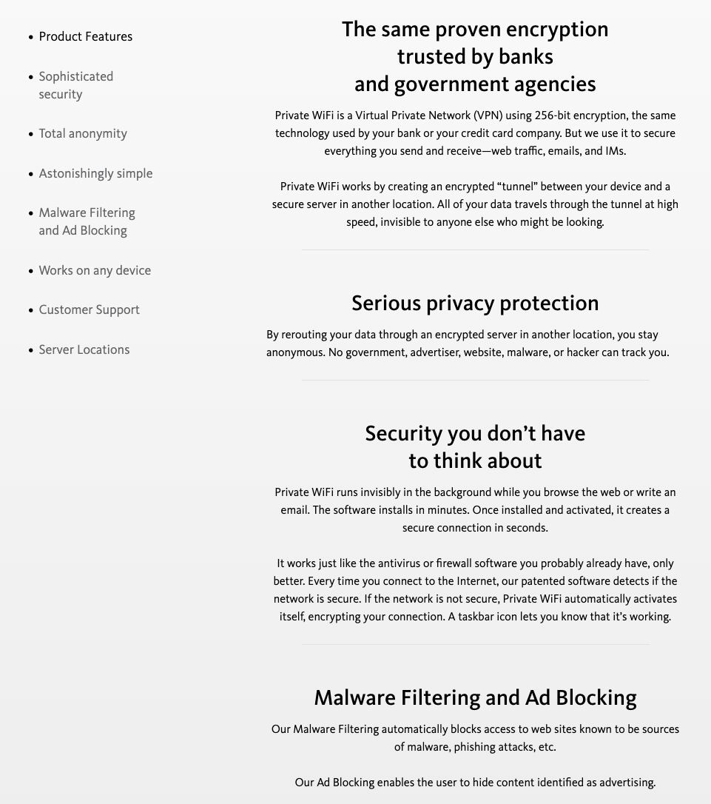

This is a war story, not a how-to. It's about my first proper consultancy project, a VPN service called PrivateWiFi. The company doesn't exist in the same form anymore. It rebranded and moved away from traditional VPNs toward Zero Trust Network Access, which is a different product for a different decade. Back when I worked on it, it was a straightforward VPN service, founded a couple of years before NordVPN existed.

I want to write it down before the edges wear off.

## Table of contents

## Hired as a Linux admin I was not

I was brought onto this project in 2012 as a Linux administrator. The catch: I had never worked as a Linux admin before. I was a network engineer. The money was good, though. Twice my network-engineer salary, which is how a young, inexperienced person talks himself into becoming responsible for hundreds of servers running all over the world.

It was a small team, which matters for the rest of the story. One Linux admin turned DevOps person, which was me, two QAs, two PHP developers by the end, an iOS developer, an Android developer, a C/Qt developer for the desktop app, and a project manager. I was the only infrastructure person on it.

Those servers were provisioned by hand. Maintained by hand too. It was a zoo. Most of them were Ubuntu, spread across whatever releases had been current when someone installed them, 10.04 here, 12.04 there. Some were Debian. Some were CentOS. Most were VPN servers, but scattered among them were API servers, a MongoDB, and a single RADIUS server.

The architecture was simple to describe. A user buys a subscription, downloads the app, runs it, and enters credentials. The app sends those credentials to an API server, which checks them against MongoDB. The credentials the user types are not the credentials OpenVPN sees, though: once the API verifies the user, it generates a set of temporary RADIUS credentials and hands those back to the app. The user picks a server, the app pulls down an OpenVPN config, and the user connects using the temporary credentials. OpenVPN checks them against RADIUS, RADIUS checks them against MongoDB, and the user is online, browsing over the VPN. Clean on a whiteboard. Less clean in practice, as the rest of this will show.

## The API layer nobody put in version control

The API servers were mid-migration from old Perl 5 code to shiny new PHP 5. The person doing that migration did not believe in version control.

There were two API servers, for high availability. There was no local copy of the code either. He'd SSH into a server, open Midnight Commander, open a file in its built-in editor, and make the change right there. When something needed patching, he patched it directly on the server. On both servers. By hand, one at a time. Which is exactly how you end up with two "identical" API servers running code that has quietly drifted out of sync. That drift becomes my problem later.

## From doing it by hand to 5,000 lines of Perl

I was hired for Linux administration, and it was a steep learning curve. But I did not want to hand-maintain a global fleet of servers, so I did what any reasonable person under pressure does: I started writing my own tool to deploy and update them.

It grew into a script that took command-line inputs, branched on the server's OS flavor, and did everything I could think to ask of it. Everything except be maintainable. Around 5,000 lines of Perl in, an obvious thought finally caught up with me: I am almost certainly not the only person on earth with this exact problem.

That thought led me to better Google searches, and better searches led me to a whole category of software I hadn't known existed: configuration management. CFEngine, Puppet, Chef, and a very new, very raw Ansible. I picked Chef, because at the time it was the most feature-rich and the most manageable of the bunch. (Ansible overtook it as my tool of choice in the years that followed.) The same searches introduced me to the emerging DevOps movement, and that's the door I walked through to move into the DevOps world.

So the progression took a few months: manual deployments, then the Perl script, then Chef. Getting off the script and onto real configuration management is what freed up enough of my attention to take on the next thing.

## Interviewing PHP developers when I didn't know PHP

With deployments under control, I could finally look at the Perl-to-PHP migration. The person who had been doing it, the one who didn't believe in version control, left for another job. The migration landed in my lap.

I am not a PHP developer. So my task was to hire a senior PHP developer. That sounds backwards, and it was, but it was the job. I skimmed the Zend certification material to get myself up to speed enough to hold an interview, and I started talking to candidates.

Most of the people I rejected, I rejected on the basics rather than deep language knowledge. My bar was that anyone doing web development should know the difference between a GET and a POST request. Around 85% of the "senior" developers I interviewed could not clear it. Even once we hired someone good, I couldn't hand him a clean starting point, because there wasn't one. I first had to reconcile the split-brain code across the two API servers into a single source of truth. Only then did the new developer have something real to build on.

## The first thing I ever architected

Once all of that settled, the customer had an idea: sell extra services on top of the VPN. They wanted on-the-fly compression for pay-as-you-go customers to save them traffic. I brought my own ideas to the table too: parental control, ad-blocking, and antivirus scanning, all riding on the VPN.

This was my first real taste of system architecture, and it landed on me because I was the only infrastructure person on the team. I didn't take it on to play with new toys. I took it on because there was nobody else to.

I built it out of open-source pieces, wired together behind the VPN, because writing any of it from scratch was out of the question. I didn't have the time, the money, or the people for that. The pieces: [c-icap](https://c-icap.sourceforge.net/) for ICAP content adaptation, [clamav](https://www.clamav.net/) for antivirus, [squid](http://www.squid-cache.org/) as the proxy that routed everything, [privoxy](https://www.privoxy.org/) for ad-blocking, and [ziproxy](https://ziproxy.sourceforge.net/) for compression. I open-sourced the Chef cookbooks along the way: [c-icap](https://supermarket.chef.io/cookbooks/c-icap), [ziproxy](https://supermarket.chef.io/cookbooks/ziproxy), and [privoxy](https://supermarket.chef.io/cookbooks/privoxy).

The marketing for it looked like this, the promise of bank-grade encryption plus malware filtering and ad-blocking as selling points:

## The part that was slow, and why

After all that shipped, I noticed the whole thing felt slow. Not because of the extra services, but because of the original design.

The problem was physical distance. The API server was in the US. MongoDB was in Canada. RADIUS was somewhere else again, in its own region; I don't remember exactly where, but not near MongoDB. Remember, this was all on-premises, real hardware in real locations. So when a client in Latin America wanted to connect to a server in Australia, the path was long in both phases.

Authentication went: user in Latin America, to the API server in the US, to MongoDB in Canada, and all the way back to Latin America. Then the VPN connection went: user in Latin America to OpenVPN in Australia, which checked with RADIUS in yet another region, which in turn checked with MongoDB in Canada. Every step of that crossed oceans.

Distance was only half of it. OpenVPN is single-threaded, and that turns a slow RADIUS lookup into a fleet-wide problem. When a user connects, OpenVPN calls out to RADIUS and the main thread waits on the answer. If RADIUS takes five seconds, or worse, if it's unreachable and the plugin sits through a 60-second timeout, that one thread is blocked the whole time, and all traffic for every already-connected user on that box freezes with it.

Today you'd reach for something like a PAM asynchronous bridge to keep that lookup off the main thread. In 2013 the standard way to bolt RADIUS onto an open-source OpenVPN server was [openvpn-radiusplugin](https://github.com/OpenVPN-Community/openvpn-radiusplugin), and it made that call inline. So we had a nasty property: one user logging in against a far-away RADIUS server could stall everyone else on the box.

It also capped us. We were pulling per-user statistics for the pay-as-you-go model, so OpenVPN had to talk to RADIUS constantly, not just at login. Between the freezes and the constant chatter, we hit a hard ceiling of about 100 users per server. For a VPN provider, "100 users per box, and they all stutter when one person logs in" is not a great place to be.

## The workaround: move the cache next to the server

To fix this I designed what I called, at the time, a "workaround solution." With a decade more experience, I'd now call it a local read cache with asynchronous write-back to the system of record. Same thing, more syllables, better odds in an architecture interview.

The design was simple. I put a standalone RADIUS on each VPN server, backed by a local Redis. Then I changed the login flow. When a user authenticated through the central API server, that API still checked the user in MongoDB and minted the temporary RADIUS credentials as before, but it also pushed those temporary credentials to what I called a "Small API" running on the specific VPN server the user was headed for. That Small API wrote them into that server's local Redis, where the local RADIUS could read them.

RADIUS also wrote the traffic-consumption numbers back into Redis. A separate script ran as a cron job once a minute, read the accumulated usage out of Redis, and wrote it into MongoDB.

If I built this today I'd put a queue or two between the moving parts instead of leaning on a once-a-minute cron and Redis as the handoff. I was pretty inexperienced then, and it shows in the design. But it worked. The OpenVPN-to-RADIUS hop became local, which dropped it from seconds to sub-millisecond and killed the freeze-the-whole-box problem. The user ceiling went up roughly tenfold, from around 100 to around 1,000 per server. Or, as my CV puts it, a 900% increase.

## What I took from it

There's no tidy moral here, same as any good war story. But three things stuck.

The first is the loop I used to live: reach for a homegrown script, grow it until it hurts, then discover the whole industry already solved this and named the solution. Five thousand lines of Perl were the tuition for learning that configuration management existed, and this job is where I broke the habit. Now I look for the tool before I go the not-invented-here route, not after.

The second is that "senior" on a CV tells you very little, and a question about the basics tells you a lot.

The third is the one I'm proudest of: the local RADIUS cache. Not because the design was elegant, it wasn't, but because it came from reading the failure: single-threaded server, a far-away dependency, a hard user ceiling. Move the dependency next to the thing that depends on it, accept eventual consistency on the numbers that can tolerate it, and the ceiling lifts. I'd build it more carefully now. I wouldn't build it differently in spirit.
