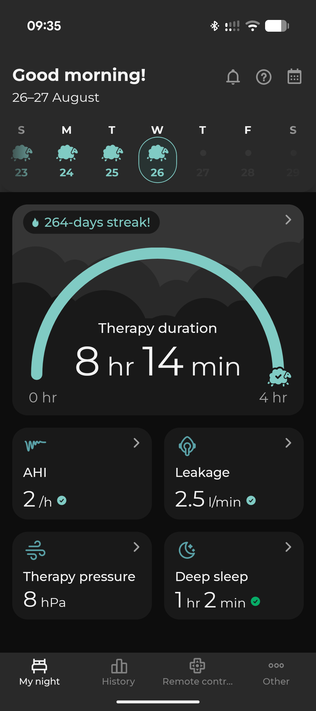

I snore. Loud. The kind of loud that makes my wife nudge me in the middle of the night, then nudge me harder, and eventually just give up sleeping herself. For years I dismissed it as a quirk. Then one morning she told me she'd been timing the gaps between my breaths, and some of them were long enough to worry her.

So I went to the doctor.

## Table of contents

## Getting the machine

What followed was a series of examinations, a sleep study, and eventually a diagnosis: obstructive sleep apnea. The treatment (not a fix, just management) is a machine. Specifically a Löwenstein Prisma APAP, a device that sits on your nightstand, connects to a mask you wear while sleeping, and continuously adjusts air pressure to keep your airway open. A very quiet, very patient robot whose only job is to make sure I keep breathing.

The machine came with a companion app. It shows a few summary numbers each morning: how long you used it, a rough score for the night, and whether your mask leaked. Useful enough. I could see that the therapy was working and that my wife was sleeping better (which was the real success metric).

## The SD card that knows too much

The doctors asked me to bring in data from the machine's SD card every few months. Not the app data, the _card_ data. Which implied the card held more than the app was showing me. Naturally, I pulled it out and looked.

The card held a structured directory tree, organized by date, with multiple file formats I'd never seen before:

- **`.wmedf` files** — waveform recordings of airflow and pressure, sample by sample, all night long
- **`event_*.xml` files** — individual respiratory events: every apnea, every hypopnea, every snore, timestamped to the decisecond
- **`.psstat` files** — nightly aggregate statistics in a JSON format with opaque numeric field keys and zero documentation
- **`.pscfg` files** — device configuration dumps

The app had been showing me a curated summary. The card had the raw feed: epoch-by-epoch evaluations, pressure histograms, event breakdowns by type, and full signal recordings. The machine overwrites after about two weeks, so if I wanted to track trends over months or spot patterns across seasons, I'd have to grab the data myself on a regular schedule.

That's when this became a project.

## Building the viewer

I built **[lowenstein-prisma-viewer](https://github.com/frostyslav/lowenstein-prisma-viewer)**, a self-hosted web app that reads the SD card, parses all those proprietary formats, and gives me a proper dashboard.

The stack is straightforward: a **FastAPI** backend (Python) that does the parsing and stores results in SQLite, and a **React** frontend with charts built on Recharts. The whole thing runs in Docker, reads the SD card directory as a mounted volume, and serves the UI on the local network. I run mine on a TrueNAS instance at home, so it's always available without needing to fire up a laptop.

What you get once it's running:

- **A dashboard** with AHI trend over time (with clinical threshold lines for mild/moderate/severe), pressure trends, leak rates, and an event breakdown showing exactly how many obstructive apneas, central apneas, hypopneas, and RERAs happened each night
- **Per-night detail views** with therapy hours, event counts, deep sleep percentage, snore percentage, flow limitation, and the actual event timeline laid out visually
- **Signal waveforms** — the raw airflow and pressure recordings, viewable in-browser for any night

For any individual night, I can drill into the full detail: every metric, every event type broken down, a timeline showing exactly when events occurred, and the raw signal waveforms sample by sample.

## The interesting technical bits

Löwenstein doesn't publish specs for any of this, so reverse-engineering the data formats was the fun part.

**The statistics format** (`.psstat`) uses JSON with numeric keys: field 5 is a timestamp, field 6 is therapy minutes, field 16 is obstructive apnea count, field 38 is RERA count, and so on. Just numbers pointing to numbers, completely opaque. I mapped them by cross-referencing the event files (which _do_ contain labeled data) against the nightly statistics until the numbers lined up. It's approximate, but it's held up across months of data.

**The waveform format** (`.wmedf`, Weinmann Modified EDF) follows the European Data Format spec with some quirks. Channels can be either 16-bit signed or 8-bit unsigned, which is unusual for EDF. The parser detects this from the digital range in the header and switches reading mode accordingly. Pressure channels are properly calibrated in hectopascals; airflow channels have an uncalibrated Y-axis but the shape is what matters clinically.

**Event timing** uses deciseconds (tenths of a second) throughout, which is a Weinmann/Löwenstein-specific choice. Each event carries a type code (101 for obstructive apnea, 102 for central apnea, 111 for obstructive hypopnea, 131 for snore, and about 15 others), a duration, the pressure at the time, and a strength indicator.

One thing that tripped me up: newer firmware versions encode epoch percentages differently, sometimes producing values over 100%. The parser caps those and moves on. Documenting these edge cases is half the point of the project, since anyone else with a Prisma machine will hit the same issues.

## What I actually learned about my sleep

More than I bargained for. The AHI number in the app is useful, but seeing the event breakdown tells a different story. I can see patterns that a single nightly average hides: which types of events dominate, when during the night they happen, how the pressure responds. That's more interesting than a single number, and it gives me better questions to bring to my next appointment.

I can also see the pressure curve adapting across the night, the leak rate creeping up when the mask shifts, and the exact moments where my airway partially collapses (flow limitation events) without quite crossing the threshold into a scored apnea. The doctors' "keep using it, looks good" now has context I can actually read.

## The 14-day problem

My current workflow: every week or two, I pull the SD card, run the import, and the data gets added to my local SQLite database. It takes a few seconds. The machine only keeps about two weeks before overwriting, which seems like a strange design choice for a medical device. If I want long-term history, I have to grab it myself.

There is, technically, a connectivity option: Löwenstein sells an external modem module that can transmit data wirelessly. But it sends your data to their cloud (prisma CLOUD), not to your local network. You get to see it through their app, on their terms. If you want the raw clinical data locally, on your own infrastructure, it's the SD card or nothing. So I pull the card.

You can find [lowenstein-prisma-viewer on GitHub](https://github.com/frostyslav/lowenstein-prisma-viewer). It's built for the Prisma series (tested on firmware 3.17.0008) but the data formats are likely shared across the Löwenstein lineup. If you have a Prisma machine and want to keep your own data, point it at your card and you've got a permanent archive. Just don't wait longer than two weeks between pulls.

If you've got a different model and want to try it, I'd be curious to hear what works and what doesn't.
